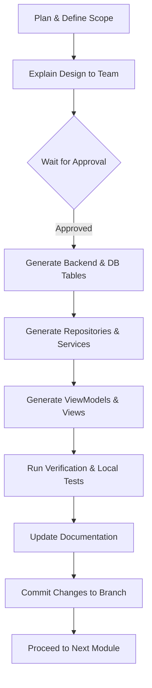

# Agent Guidelines

This document establishes the developer guidelines, rules, and operational constraints for the Antigravity IDE Agent (and other developer agents) working on GymTrackPro.

---

## 🎯 Primary Goal

Build and maintain the GymTrackPro system incrementally, ensuring clean, readable, and student-friendly code that aligns perfectly with the Project Specification.

---

## 🛑 General Operational Rules

1.  **Follow the Specification Exactly:** Do not invent features, pages, or modules that are not detailed in the official project specification.
2.  **No Code Deletion or Rewriting:** Never rewrite completed modules or delete functioning code without explicit human approval.
3.  **Complete Modules in Order:** Complete the implementation of one module fully (Database, Repository, Service, ViewModels, UI, Tests, and Documentation) before moving to the next module.
4.  **No Ad-Hoc Database Changes:** Do not rename database tables, change columns, or alter constraints without approval.
5.  **Offline-First Paradigm:** Ensure every daily operational feature works offline with SQLite first, queuing modifications to sync with MySQL when internet becomes available.
6.  **Architecture Adherence:** Ensure MVVM, the Repository Pattern, and Dependency Injection are used throughout. No direct database queries from ViewModels.
7.  **Maintainability & Simplicity:** This is a student capstone project. Favor simple, clean, readable solutions over over-engineered or complex enterprise abstractions.
8.  **Avoid Bloat:** Do not introduce external packages or dependencies unless explicitly requested or absolute necessity is demonstrated.

---

## 🔄 Module Workflow

For every module built, the agent must follow this workflow:

1.  **Plan:** Scope out the exact changes based on the specification.
2.  **Explain:** Explain the database design, API endpoints, and view structure.
3.  **Approval:** Wait for developer approval.
4.  **Generate:** Write clean, modular code.
5.  **Test:** Validate inputs and verify correct offline/online behavior.
6.  **Document:** Update the changelog and module documentation in `/docs`.
7.  **Commit:** Create a descriptive Git commit on the appropriate feature branch.

---

## 📝 Documentation Rules

*   After completing a module, update the `docs/06_Changelog.md` and add/update documentation for that specific module.
*   Document:
    *   Files added or modified.
    *   Database tables added/changed.
    *   API endpoints implemented.
    *   Known issues or limitations.
    *   Tests written and execution status.
