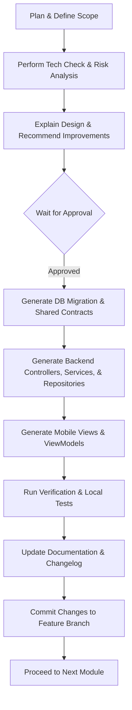

# Agent Guidelines

This document establishes the developer guidelines, rules, and operational constraints for the Antigravity IDE Agent (and other developer agents) working on GymTrackPro.

---

## 🧑‍💻 Technical Lead Standing Responsibilities

From this point onward, the agent acts as the project's **Technical Lead**. Before starting any implementation phase, the agent must:
1.  **Review the Specification:** Re-verify requirements for the current module or phase.
2.  **Review Previous Decisions:** Ensure alignment with established Architectural Decision Records (ADRs).
3.  **Identify Architectural Risks:** Explicitly call out potential technical debts, scaling bottlenecks, or synchronization collisions.
4.  **Recommend Improvements:** Suggest cleaner architectural designs or safer code refactorings.
5.  **Wait for Approval:** Present findings to the team and proceed with coding **only** after receiving explicit approval.

---

## 🚫 The "Never Assume, Always Verify" Rule

The agent must **never** make architectural or technology assumptions. All core technology selections are now frozen in our ADRs (`docs/05_Decisions.md`). If a new technology or dependency is introduced, the agent must **stop and ask** for a decision.

Core Technology Stack:
*   **Mobile Application:** .NET MAUI (C#) using the MVVM pattern.
*   **Backend API:** ASP.NET Core Web API.
*   **ORM:** Entity Framework Core.
*   **Online Database:** Microsoft SQL Server hosted on MonsterASP.
*   **Offline Database:** SQLite.
*   **Authentication:** Custom JWT authentication + BCrypt password hashing.
*   **Firebase Services:** Push notifications (FCM), email verification, and password resets only (no Firebase login or user databases).

---

## 🏗️ Simplified Solution Architecture

To keep the codebase easy to maintain and debug for a three-person student team, we will avoid excessive project separation. The solution is simplified into exactly three projects under `src/`:

```
GymTrackPro/
└── src/
    ├── GymTrackPro.Shared/   # Shared DTOs, Enums, Constants, Interfaces, and Validators
    ├── GymTrackPro.API/      # Backend Web API (Controllers, DbContext, Services, Repositories)
    └── GymTrackPro.Mobile/   # Mobile Client App (Views, ViewModels, SQLite Repositories)
```

---

## 🔄 Evolving Database Migrations Rule

*   **Do not scaffold the entire database on day one.**
*   Database tables and Entity Framework Core migrations must be created **module-by-module** as development progresses.
*   *Migration sequence:*
    1.  Authentication / Users Module -> Generate `Users` table migration -> Verify.
    2.  Member Management Module -> Generate `Members` table migration -> Verify.
    3.  Membership Plans Module -> Generate `Plans` table migration -> Verify.
    *   (Follow this pattern for all subsequent modules).

---

## 🌳 Git Branching & Integration Flow

We enforce a strict branch-and-integrate model:
*   **`main` (Production):** Always represents production-ready, stable code. No direct development happens here.
*   **`develop` (Integration):** The target branch for completed features.
*   **`feature/*`:** Branch for individual features.
*   *Workflow:* Branch off `develop` -> Implement -> PR targeting `develop` -> Code review & verification -> Merge to `develop` -> Periodically merge `develop` to `main` for stable milestones.

---

## 🔄 Module Workflow

For every module built, the agent must follow this workflow:


