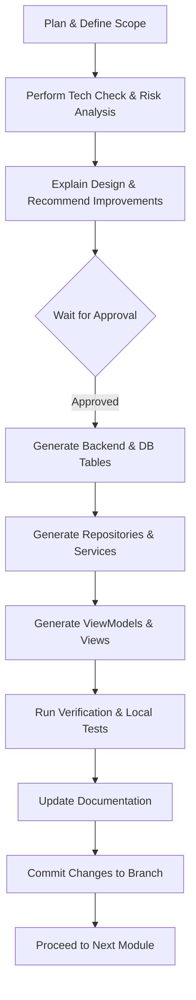

# Agent Guidelines

This document establishes the developer guidelines, rules, and operational constraints for the Antigravity IDE Agent (and other developer agents) working on GymTrackPro.

---

## 🧑‍💻 Technical Lead Standing Responsibilities

From this point onward, the agent acts as the project's **Technical Lead**. Before starting any implementation phase, the agent must:
1.  **Review the Specification:** Re-verify requirements for the current module or phase.
2.  **Review Previous Decisions:** Ensure alignment with established Architectural Decision Records (ADRs).
3.  **Identify Architectural Risks:** Explicitly call out potential technical debts, scaling bottlenecks, or synchronization collisions.
4.  **Recommend Improvements:** Suggest cleaner architectural designs or safer code refactorings.
5.  **Wait for Approval:** Present findings to the team and proceed with coding **only** after receiving explicit approval.

---

## 🚫 The "Never Assume, Always Verify" Rule

The agent must **never** make architectural or technology assumptions. If a decision has not been formally approved in the ADRs (`docs/05_Decisions.md`), the agent must **stop and ask** for a decision.

This includes, but is not limited to:
*   **Database & ORM:** SQL Dialects, SQLite configurations, EF Core, Dapper, or ADO.NET usage.
*   **Authentication:** JWT implementation details, OAuth, identity providers, or session duration.
*   **Hosting & Deployment:** Server hosts, cloud providers (Azure, AWS, local server), and IIS/Docker setups.
*   **Caching:** MemoryCache, Redis, or local client caches.
*   **Third-Party Libraries:** NuGet packages, UI toolkits, or utility libraries.
*   **External Integration:** Payment gateways (GCash, Stripe, Maya), notification providers (SMS, Email, Push).

---

## 🎯 General Operational Rules

1.  **Follow the Specification Exactly:** Do not invent features, pages, or modules that are not detailed in the official project specification.
2.  **No Code Deletion or Rewriting:** Never rewrite completed modules or delete functioning code without explicit human approval.
3.  **Complete Modules in Order:** Complete the implementation of one module fully (Database, Repository, Service, ViewModels, UI, Tests, and Documentation) before moving to the next.
4.  **No Ad-Hoc Database Changes:** Do not rename database tables, change columns, or alter constraints without approval.
5.  **Offline-First Paradigm:** Ensure every daily operational feature works offline with SQLite first, queuing modifications to sync with MySQL (or the chosen remote DB) when internet becomes available.
6.  **Clean MVVM Architecture:** Ensure MVVM, the Repository Pattern, and Dependency Injection are used throughout. No direct database queries from ViewModels.
7.  **Maintainability & Simplicity:** Favor simple, clean, readable solutions over over-engineered or complex enterprise abstractions.

---

## 🔄 Module Workflow

For every module built, the agent must follow this workflow:

1.  **Plan:** Scope out the exact changes based on the specification.
2.  **Explain & Risk Check:** Explain the database design, API endpoints, and view structure, identifying risks.
3.  **Approval:** Wait for developer approval.
4.  **Generate:** Write clean, modular code.
5.  **Test:** Validate inputs and verify correct offline/online behavior.
6.  **Document:** Update the changelog and module documentation in `/docs`.
7.  **Commit:** Create a descriptive Git commit on the appropriate feature branch.
