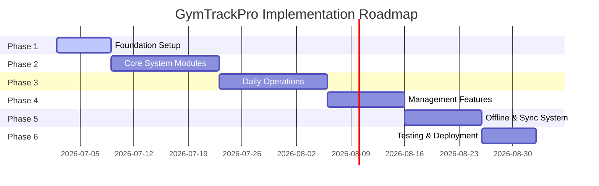

# Development Roadmap

This document outlines the phase-by-phase development plan for GymTrackPro. Each phase must be completed and approved before starting the next.

---

## 📅 Roadmap Overview

---

## 🔍 Phase breakdown

### 🛠️ Phase 1 – Foundation
Set up the basic infrastructure, solution templates, and core configurations.
*   **Tasks:**
    *   Initialize solution structure (`GymTrackPro.sln`, `GymTrackPro.API.csproj`, `GymTrackPro.Mobile.csproj`).
    *   Configure database connection and Entity Framework Core in the Web API.
    *   Set up Dependency Injection containers.
    *   Implement core Authentication logic (JWT generation, login/logout services, and Password Hashing).
*   **Deliverables:** Compilation-ready base projects with functioning authentication endpoints.

### 👥 Phase 2 – Core System Modules
Build the primary administrative and membership records in the system.
*   **Build Order:**
    1.  **User Management:** Accounts creation, roles, and status (Admin Only).
    2.  **Member Management:** Registering, search, filtering, and deactivation.
    3.  **Membership Plans:** Creation, pricing, and duration setup.
    4.  **Membership Subscriptions:** Plan assignment and renewal logic.
    5.  **Membership Pause:** Temporary pause and resume mechanisms with date shifting.
*   **Constraint:** Complete one module entirely before moving to the next.

### 💳 Phase 3 – Daily Operations
Implement front-desk and check-in workflows.
*   **Build Order:**
    1.  **Payments:** Fee payments, balance updates, receipt generation.
    2.  **Attendance:** Simple manual check-in/check-out logs.
    3.  **QR Attendance:** Scanner integration, unique QR code verification.
    4.  **Walk-In Visitors:** Track walk-in visits and collect one-day fees.
    5.  **Notifications:** Internal reminders (expirations, sync failures).

### 📊 Phase 4 – Management Features
Implement operational insights, audit compliance, and general preferences.
*   **Build Order:**
    1.  **Reports:** Financial summaries, attendance records, member counts, and exports (PDF/Excel).
    2.  **Settings:** Gym information, status color coding, discount thresholds, and theme toggling.
    3.  **Audit Logs:** Automatic tracking of critical user activities.

### 🔄 Phase 5 – Offline & Synchronization
Enable offline reliability through SQLite and a custom synchronization layer.
*   **Tasks:**
    *   Implement SQLite local database.
    *   Develop the **Sync Queue** structure in SQLite.
    *   Build automatic connectivity detection.
    *   Implement conflict resolution rules ("Newest Update Wins" using `LastModified` timestamps).
    *   Integrate UI status indicators (Synced, Pending Sync, Syncing, Failed).

### 🧪 Phase 6 – Testing & Deployment
Stabilize the system for rollout.
*   **Tasks:**
    *   Write and execute Unit Tests for core business rules (e.g. attendance constraints, payment ceilings).
    *   Perform Integration Tests (mobile check-in syncing to Web API).
    *   Conduct User Acceptance Testing (UAT) with dummy roles.
    *   Fix bugs, optimize performance, and deploy databases.

---

## 🏁 Definition of Done (DoD)

A module is declared **complete** only when it meets the following criteria:
1.  **Database:** Relevant SQLite & MySQL tables are created with proper indexes.
2.  **Logic:** Service, Repository, and Controller classes are implemented.
3.  **UI:** Appropriate Views and ViewModels are built, following MVVM.
4.  **Validation:** Form inputs are validated on both Client and API.
5.  **Testing:** Local unit tests are written and pass.
6.  **Offline Support:** Local read/write operations and sync queue integration are tested.
7.  **Documentation:** The module details are updated in the project files and `Changelog.md`.
