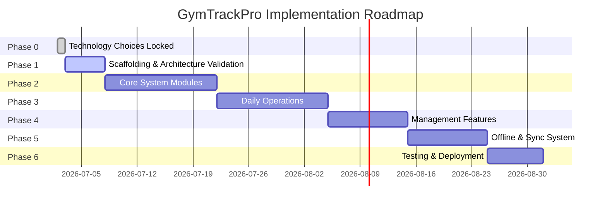

# Development Roadmap

This document outlines the phase-by-phase development plan for GymTrackPro. Each phase must be completed and approved before starting the next.

---

## 📅 Roadmap Overview

---

## 🔍 Phase Breakdown

### 🎯 Phase 0 – Technology Decisions (Complete)
Core technology decisions have been locked:
*   **Mobile Framework:** .NET MAUI (C#) using MVVM.
*   **Web API:** ASP.NET Core Web API.
*   **ORM:** Entity Framework Core (EF Core).
*   **Server Database:** Microsoft SQL Server hosted on MonsterASP.
*   **Local Database:** SQLite.
*   **Authentication:** Custom JWT generation + BCrypt password hashing.
*   **Firebase Services:** Email resets, verification emails, and push notifications only.

### 🛠️ Phase 1 – Scaffolding & Architecture Validation
Set up the base code infrastructure and verify the dependency graph and compilation.
*   **Tasks:**
    *   Create a blank solution `GymTrackPro.sln` inside `src/`.
    *   Scaffold exactly three projects:
        *   `GymTrackPro.Shared` (Class Library)
        *   `GymTrackPro.API` (ASP.NET Core Web API)
        *   `GymTrackPro.Mobile` (.NET MAUI Mobile App)
    *   Set up dependency references:
        *   `GymTrackPro.API` references `GymTrackPro.Shared`.
        *   `GymTrackPro.Mobile` references `GymTrackPro.Shared`.
    *   Verify target frameworks (.NET 8/9), workload installations, and compile the blank solution.
    *   Verify the GitHub build CI pipeline runs successfully on this scaffolded solution.
*   **Deliverables:** A compiling, clean 3-project solution inside `src/` passing GitHub Actions CI check.

### 👥 Phase 2 – Core System Modules
Build the primary administrative and membership records in the system. Evolve migrations table-by-table.
*   **Build Order:**
    1.  **User Management & Auth:** Setup `Users` table and local/remote JWT authentication logic.
    2.  **Member Management:** Setup `Members` table, registration, profile views, and deactivation.
    3.  **Membership Plans:** Setup `MembershipPlans` table and management views.
    4.  **Membership Subscriptions:** Setup `Subscriptions` table, plan assignment, and renewals.
    5.  **Membership Pause:** Setup `MembershipPause` table and suspend/resume actions.

### 💳 Phase 3 – Daily Operations
Implement front-desk and check-in workflows.
*   **Build Order:**
    1.  **Payments:** Setup `Payments` table, payment records, and receipt histories.
    2.  **Attendance:** Setup `Attendance` table and check-in/check-out logs.
    3.  **QR Attendance:** Validate QR scanners and link them to attendance check-ins.
    4.  **Walk-In Visitors:** Setup `WalkInVisitors` table for day passes.
    5.  **Notifications:** Setup `Notifications` table. Integrate Firebase Cloud Messaging (FCM).

### 📊 Phase 4 – Management Features
Implement operational insights, audit compliance, and general preferences.
*   **Build Order:**
    1.  **Reports:** Financial summaries, attendance records, and exports.
    2.  **Settings:** Global configurations (colors, discounts, themes).
    3.  **Audit Logs:** Setup `AuditLogs` table and trace background activities.

### 🔄 Phase 5 – Offline & Synchronization
Enable offline reliability through SQLite and a custom synchronization layer.
*   **Tasks:**
    *   Configure local SQLite databases in the mobile project.
    *   Implement the `SyncQueue` table locally.
    *   Develop network connectivity monitors and the Sync Coordinator.
    *   Implement "Newest Update Wins" conflict resolution.
    *   Integrate UI status indicators.

### 🧪 Phase 6 – Testing & Deployment
Stabilize the system for rollout.
*   **Tasks:**
    *   Write and execute Unit Tests for domain rules and use cases.
    *   Perform Integration Tests (mobile check-in syncing to Server).
    *   Conduct User Acceptance Testing (UAT).
    *   Deploy SQL Server on MonsterASP and publish the Web API.

---

## 🏁 Definition of Done (DoD)
Please refer to `docs/09_Definition_of_Done.md` for our detailed checklist for declaring any module completed.
