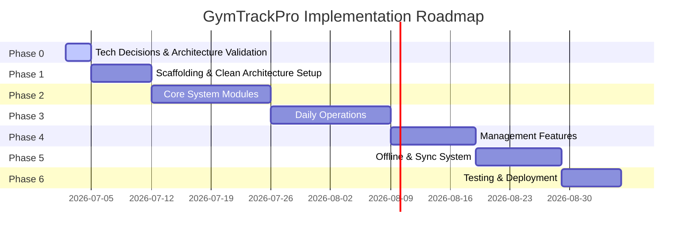

# Development Roadmap

This document outlines the phase-by-phase development plan for GymTrackPro. Each phase must be completed and approved before starting the next.

---

## 📅 Roadmap Overview

---

## 🔍 Phase Breakdown

### 🎯 Phase 0 – Technology Decisions & Architecture Validation
Before creating project files, we must analyze the specification and formally decide our technology stack.
*   **Tasks:**
    *   Evaluate and approve the Server-side database (MySQL vs SQL Server vs PostgreSQL).
    *   Evaluate and approve the Client-side local database (SQLite vs LiteDB).
    *   Evaluate and approve the Server-side Data Access Layer (Entity Framework Core vs Dapper vs ADO.NET).
    *   Evaluate and approve the Authentication provider/pattern (Custom JWT vs ASP.NET Identity vs external OAuth).
    *   Define hosting, deployment strategies, and external integration providers (GCash, SMS gateways).
*   **Deliverables:** Formally signed off Architectural Decision Records (ADRs) for each category.

### 🛠️ Phase 1 – Scaffolding & Clean Architecture Setup
Set up the base code infrastructure according to the approved tech choices.
*   **Tasks:**
    *   Initialize solution structure following Clean Architecture principles:
        *   `GymTrackPro.Domain` (Entities, Value Objects, Domain Exceptions)
        *   `GymTrackPro.Application` (Interfaces, DTOs, CQRS/Use Cases, Validators)
        *   `GymTrackPro.Infrastructure` (Data Access, Sync Queue, External Services)
        *   `GymTrackPro.Shared` (Enums, Constants, General Utilities)
        *   `GymTrackPro.Server` / `GymTrackPro.API` (Web Host, Controllers, Middleware)
        *   `GymTrackPro.Client` / `GymTrackPro.Mobile` (MAUI Views, ViewModels, Sync background workers)
    *   Configure CI workflows and PR templates in GitHub.
    *   Create base DB Context/Connections and run initial verification.
*   **Deliverables:** Compilation-ready base solution with CI passing and base directories structured.

### 👥 Phase 2 – Core System Modules
Build the primary administrative and membership records in the system.
*   **Build Order:**
    1.  **User Management:** Accounts creation, roles, and status (Admin Only).
    2.  **Member Management:** Registering, search, filtering, and deactivation.
    3.  **Membership Plans:** Creation, pricing, and duration setup.
    4.  **Membership Subscriptions:** Plan assignment and renewal logic.
    5.  **Membership Pause:** Temporary pause and resume mechanisms with date shifting.
*   **Constraint:** Complete one module entirely before moving to the next.

### 💳 Phase 3 – Daily Operations
Implement front-desk and check-in workflows.
*   **Build Order:**
    1.  **Payments:** Fee payments, balance updates, receipt generation.
    2.  **Attendance:** Simple manual check-in/check-out logs.
    3.  **QR Attendance:** Scanner integration, unique QR code verification.
    4.  **Walk-In Visitors:** Track walk-in visits and collect one-day fees.
    5.  **Notifications:** Internal reminders (expirations, sync failures).

### 📊 Phase 4 – Management Features
Implement operational insights, audit compliance, and general preferences.
*   **Build Order:**
    1.  **Reports:** Financial summaries, attendance records, member counts, and exports.
    2.  **Settings:** Gym information, status color coding, discount thresholds, and theme toggling.
    3.  **Audit Logs:** Automatic tracking of critical user activities.

### 🔄 Phase 5 – Offline & Synchronization
Enable offline reliability through SQLite and a custom synchronization layer.
*   **Tasks:**
    *   Implement SQLite local database and repositories in `Infrastructure`.
    *   Develop the **Sync Queue** structure in SQLite.
    *   Build automatic connectivity detection and Sync Coordinator.
    *   Implement conflict resolution rules ("Newest Update Wins" using `LastModified` timestamps).
    *   Integrate UI status indicators.

### 🧪 Phase 6 – Testing & Deployment
Stabilize the system for rollout.
*   **Tasks:**
    *   Write and execute Unit Tests for domain rules and use cases.
    *   Perform Integration Tests (mobile check-in syncing to Server).
    *   Conduct User Acceptance Testing (UAT).
    *   Deploy databases and API host.

---

## 🏁 Definition of Done (DoD)

A module is declared **complete** only when it meets the following criteria:
1.  **Database:** Relevant SQLite & Server DB tables are created with proper indexes.
2.  **Logic:** Domain Models, DTOs, Use Cases, Repositories, Services, and Controllers are implemented.
3.  **UI:** Appropriate Views and ViewModels are built, following MVVM.
4.  **Validation:** Form inputs are validated on both Client and Server.
5.  **Testing:** Local unit tests are written and pass.
6.  **Offline Support:** Local read/write operations and sync queue integration are tested.
7.  **Documentation:** The module details are updated in the project files and `Changelog.md`.
