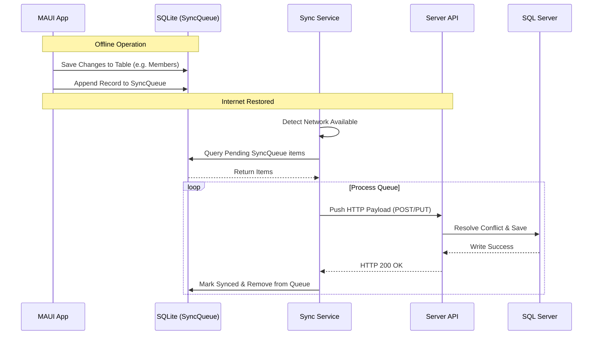
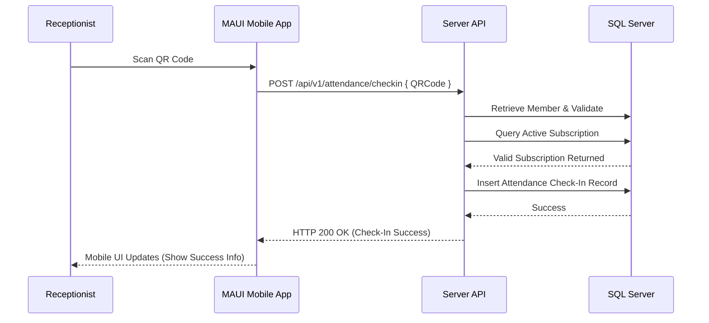

# System Architecture

GymTrackPro uses a simplified C# solution architecture coupled with a layered Presentation system on the client. It is engineered with an **Offline-First** mindset to support constant operability at gym check-in desks.

---

## 🏛️ Simplified Solution Layering

To prevent over-complication for a three-person student team, our architecture is grouped into exactly three projects under `src/`:

```mermaid
graph TD
    subgraph GymTrackPro.Shared
        Contracts[DTOs, Enums, Constants, General Helpers, Validators]
    end

    subgraph GymTrackPro.Mobile (MAUI Client)
        Views[XAML Views]
        VMs[ViewModels]
        ClientServices[Client Services - Sync, Network]
        ClientRepos[Client Repositories - SQLite]
        SQLite[(SQLite Local DB)]
        
        Views <--> VMs
        VMs <--> ClientServices
        ClientServices <--> ClientRepos
        ClientRepos <--> SQLite
    end

    subgraph GymTrackPro.API (ASP.NET Core Server)
        Controllers[API Controllers]
        ServerServices[Business Services]
        ServerRepos[Repositories - EF Core]
        SQLServer[(SQL Server MonsterASP)]
        
        Controllers <--> ServerServices
        ServerServices <--> ServerRepos
        ServerRepos <--> SQLServer
    end

    GymTrackPro.Mobile -- References --> GymTrackPro.Shared
    GymTrackPro.API -- References --> GymTrackPro.Shared
    GymTrackPro.Mobile -- HTTPS REST (JWT) --> GymTrackPro.API
```

### 1. Shared Project (`GymTrackPro.Shared`)
Contains the common definitions used by both the Mobile app and the Web API.
*   **Contents:** Data Transfer Objects (DTOs), common enums (e.g. `MembershipStatus`), static constants (e.g. error strings), shared helper classes, common validation rules, and core domain model definitions.
*   **Rule:** This project is a simple .NET Class Library. It has no dependencies on external web hosting or UI frameworks.

### 2. Backend Web API (`GymTrackPro.API`)
Acts as the central business logic controller and handles secure data persistence on the server.
*   **Contents:** Controllers (REST endpoints), business services, repositories (using EF Core), the database context (`DbContext`) pointing to Microsoft SQL Server hosted on MonsterASP, custom authentication middlewares, and password utilities (BCrypt).
*   **Rule:** The API never has dependency references to MAUI or mobile libraries. It is a standalone web host.

### 3. Mobile Client (`GymTrackPro.Mobile`)
A cross-platform native app built with .NET MAUI running on the Windows/Android/macOS/iOS devices at the gym front desk.
*   **Views:** Bind to ViewModels using native XAML bindings. No logic exists in code-behind files.
*   **ViewModels:** Expose UI state and handle commands (using `CommunityToolkit.Mvvm`).
*   **Services:** Manage network connectivity, local workflows, and synchronization.
*   **Repositories:** Execute queries against the local **SQLite** database.

---

## 🔑 Authentication & Firebase Boundaries

Our identity management is divided cleanly to minimize dependencies and support offline operation:

```
                  ┌──────────────────────────────────────────────┐
                  │                 User login                   │
                  └──────────────────────┬───────────────────────┘
                                         │
                        ┌────────────────┴────────────────┐
                        │                                 │
                 [ Device Online ]                [ Device Offline ]
                        │                                 │
            ┌───────────▼───────────┐           ┌─────────▼─────────┐
            │ Connect to Web API    │           │ Validate against  │
            │ Validate BCrypt Hash  │           │ locally cached    │
            │ Issue JWT Session     │           │ user token credentials
            └───────────────────────┘           └───────────────────┘
```

1.  **Authentication Control:** Handled entirely by our ASP.NET Core API using BCrypt to verify hashed passwords stored in SQL Server and generating JSON Web Tokens (JWT) for authenticated sessions.
2.  **Firebase Limitations:** Firebase is **not** used as an identity provider or database. Its usage is strictly restricted to supporting side-channels:
    *   **Firebase Cloud Messaging (FCM):** Sends background push notifications (such as membership expiry alerts).
    *   **Firebase Email Service:** Dispatches email verification links and password reset emails initiated by our backend API.

---

## 🔄 Offline-First & Synchronization Mechanism

To ensure the gym receptionist can check in members even during an internet outage, GymTrackPro writes data locally first and syncs upstream asynchronously.

### 🗳&nbsp; The Synchronization Queue
1.  **Write Operations:** When a user creates or edits a record, the client app writes the change directly to the local SQLite database.
2.  **Queue Entry:** A sync queue entry is written to SQLite containing the target table name, target record ID, the action type (Create, Update, Delete), and a `LastModified` timestamp.
3.  **Connection Monitor:** The app listens to the network status. When a connection is detected, a background worker processes the sync queue:
    *   It retrieves the pending queue items in order.
    *   It sends HTTP requests with payloads to the Server API.
    *   Upon receiving an HTTP 200 OK from the API, it marks the local record as "Synced" and purges the sync queue entry.

### ⚔&nbsp; Conflict Resolution ("Newest Update Wins")
When the API receives an update for a record that has also been modified elsewhere:
*   It compares the `LastModified` timestamp from the incoming client payload with the database record's `LastModified` timestamp.
*   The record with the **newest** timestamp is saved.
*   An audit log entry is written to record the resolution.

---

## 🌊 Sequence Diagrams

### Offline Sync Flow


### Attendance Check-In Flow

