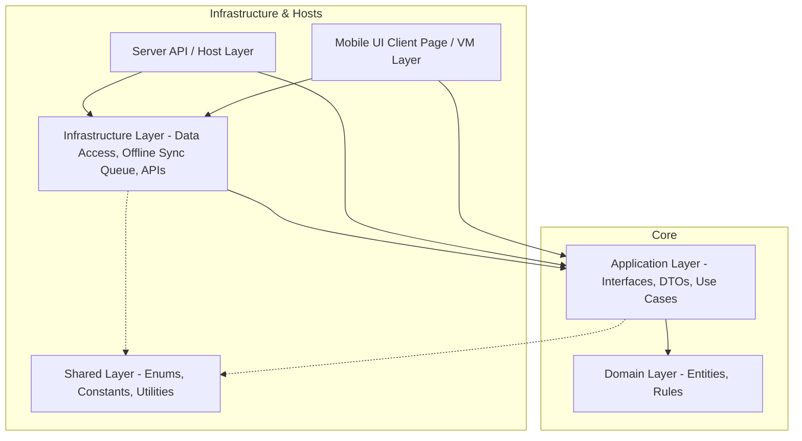

# System Architecture

GymTrackPro uses a Clean Architecture design coupled with a layered Presentation system on the client. It is engineered with an **Offline-First** mindset to support constant operability at gym check-in desks.

---

## 🏛️ Clean Architecture Layers Diagram

The project structure decouples our core domain models and business rules from external details like databases, UI frameworks, and ORMs.

### 1. Domain Layer (`GymTrackPro.Domain`)
The core of the application. It contains the business entities, value objects, exceptions, and core domain constraints.
*   **Rule:** It has zero dependencies on other layers or third-party libraries (except for basic framework types). It is entirely decoupled from database technology or UI bindings.

### 2. Application Layer (`GymTrackPro.Application`)
Defines the behavior and capabilities of the system. It houses the interfaces, data transfer contracts (DTOs), validators, and use-case handlers.
*   **Rule:** It depends only on the Domain Layer. It defines interfaces (e.g. `IMemberRepository`) but does not implement them.

### 3. Infrastructure Layer (`GymTrackPro.Infrastructure`)
Contains all the concrete implementations of interfaces defined in the Application layer, such as data persistence providers, synchronization coordinators, and external service adapters.
*   **Rule:** It handles database queries, network status monitoring, and sync queue processing.

### 4. Shared Layer (`GymTrackPro.Shared`)
A common utility project containing enums, global constants, validation helpers, and general utilities used across multiple projects (API, Client, and Core).
*   **Rule:** It has zero business logic and depends on nothing but basic System namespace assemblies.

### 5. Presentation / Client Host (`GymTrackPro.Mobile`)
Implements the user interface for gym receptionists and admins. It follows the **MVVM (Model-View-ViewModel)** pattern.
*   **Views:** Bind to ViewModels. They must never contain logic or talk to repositories directly.
*   **ViewModels:** Expose properties and commands, dispatching user intents to Application-level interfaces.

---

## 🔄 Offline-First & Synchronization Mechanism

To ensure the gym receptionist can check in members even during an internet outage, GymTrackPro writes data locally first and syncs upstream asynchronously.

### 🗳️ The Synchronization Queue
1.  **Write Operations:** When a user creates or edits a record, the client app writes the change directly to the local database.
2.  **Queue Entry:** A sync queue entry is written to local storage containing the target table name, target record ID, the action type (Create, Update, Delete), and a `LastModified` timestamp.
3.  **Connection Monitor:** The app listens to the network status. When a connection is detected, a background worker processes the sync queue:
    *   It retrieves the pending queue items in order.
    *   It sends HTTP requests with payloads to the Server API.
    *   Upon receiving an HTTP 200 OK from the API, it marks the local record as "Synced" and purges the sync queue entry.

### ⚔️ Conflict Resolution ("Newest Update Wins")
When the API receives an update for a record that has also been modified elsewhere:
*   It compares the `LastModified` timestamp from the incoming client payload with the database record's `LastModified` timestamp.
*   The record with the **newest** timestamp is saved.
*   An audit log entry is written to record the resolution.

### 🗑️ Soft Deletion Rules
Records are never deleted immediately.
1.  On delete, a `Deleted` flag (or `Status = 'Inactive'`) is set on the local database.
2.  An update is queued in the sync queue.
3.  The API processes the soft delete.
4.  Only after confirmation is the local record updated accordingly.

---

## 🔒 Architectural Constraints (Phase 0 Pending)
*   **Database & ORM Choice:** The specific database engine (MySQL/PostgreSQL/SQL Server for remote, SQLite/LiteDB for local) and Data Access technology (EF Core vs Dapper vs ADO.NET) are currently **pending validation** in Phase 0. No code or scaffolding for persistence should begin until these choices are explicitly approved in the ADRs.
