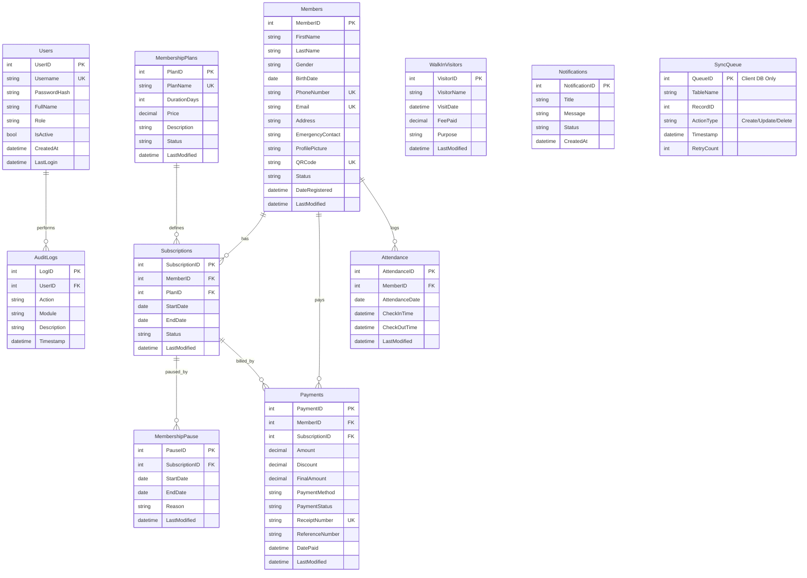

# Database Design

GymTrackPro uses a dual-database model:
*   **Server Database:** Central database representing the source of truth, hosted online (MySQL, PostgreSQL, or SQL Server - TBD in Phase 0).
*   **Local Client Database:** Client-side database embedded in the mobile application for offline capabilities (SQLite or LiteDB - TBD in Phase 0).

---

## 🗺️ Entity Relationship Diagram (ERD)

---

## 📋 Schema Details

### 1. `Users` Table
Stores gym administrators and receptionists.
*   `UserID` (INT, PK, AutoIncrement)
*   `Username` (VARCHAR(50), Unique, Not Null)
*   `PasswordHash` (VARCHAR(255), Not Null)
*   `FullName` (VARCHAR(100), Not Null)
*   `Role` (VARCHAR(20), Not Null) -- 'Administrator' or 'Receptionist'
*   `IsActive` (BOOLEAN, Default True)
*   `CreatedAt` (DATETIME, Not Null)
*   `LastLogin` (DATETIME, Nullable)

### 2. `Members` Table
Stores complete profile information of gym members.
*   `MemberID` (INT, PK, AutoIncrement)
*   `FirstName` (VARCHAR(50), Not Null)
*   `LastName` (VARCHAR(50), Not Null)
*   `Gender` (VARCHAR(10), Not Null)
*   `BirthDate` (DATE, Not Null)
*   `PhoneNumber` (VARCHAR(20), Unique, Not Null)
*   `Email` (VARCHAR(100), Unique, Nullable)
*   `Address` (VARCHAR(255), Nullable)
*   `EmergencyContact` (VARCHAR(100), Not Null)
*   `ProfilePicture` (VARCHAR(255), Nullable) -- File path or blob string
*   `QRCode` (VARCHAR(100), Unique, Not Null)
*   `Status` (VARCHAR(20), Not Null) -- 'Active', 'Paused', 'Expired', 'Inactive'
*   `DateRegistered` (DATETIME, Not Null)
*   `LastModified` (DATETIME, Not Null)

### 3. `MembershipPlans` Table
Stores details of standard membership tiers offered.
*   `PlanID` (INT, PK, AutoIncrement)
*   `PlanName` (VARCHAR(50), Unique, Not Null)
*   `DurationDays` (INT, Not Null)
*   `Price` (DECIMAL(10,2), Not Null)
*   `Description` (VARCHAR(255), Nullable)
*   `Status` (VARCHAR(20), Default 'Active') -- 'Active' or 'Inactive'
*   `LastModified` (DATETIME, Not Null)

### 4. `Subscriptions` Table
Tracks plan assignments to members.
*   `SubscriptionID` (INT, PK, AutoIncrement)
*   `MemberID` (INT, FK -> Members.MemberID, Not Null)
*   `PlanID` (INT, FK -> MembershipPlans.PlanID, Not Null)
*   `StartDate` (DATE, Not Null)
*   `EndDate` (DATE, Not Null)
*   `Status` (VARCHAR(20), Not Null) -- 'Active', 'Expired', 'Paused'
*   `LastModified` (DATETIME, Not Null)

### 5. `MembershipPause` Table
Records subscriptions currently suspended.
*   `PauseID` (INT, PK, AutoIncrement)
*   `SubscriptionID` (INT, FK -> Subscriptions.SubscriptionID, Not Null)
*   `StartDate` (DATE, Not Null)
*   `EndDate` (DATE, Not Null)
*   `Reason` (VARCHAR(255), Nullable)
*   `LastModified` (DATETIME, Not Null)

### 6. `Payments` Table
Stores records of financial transactions.
*   `PaymentID` (INT, PK, AutoIncrement)
*   `MemberID` (INT, FK -> Members.MemberID, Not Null)
*   `SubscriptionID` (INT, FK -> Subscriptions.SubscriptionID, Not Null)
*   `Amount` (DECIMAL(10,2), Not Null)
*   `Discount` (DECIMAL(10,2), Default 0.00)
*   `FinalAmount` (DECIMAL(10,2), Not Null)
*   `PaymentMethod` (VARCHAR(20), Not Null) -- 'Cash', 'GCash', 'Card', 'Bank Transfer'
*   `PaymentStatus` (VARCHAR(20), Not Null) -- 'Paid', 'Partial', 'Pending'
*   `ReceiptNumber` (VARCHAR(50), Unique, Not Null)
*   `ReferenceNumber` (VARCHAR(100), Nullable) -- For Gcash/Bank Transfer
*   `DatePaid` (DATETIME, Not Null)
*   `LastModified` (DATETIME, Not Null)

### 7. `Attendance` Table
Logs daily check-in and check-out information.
*   `AttendanceID` (INT, PK, AutoIncrement)
*   `MemberID` (INT, FK -> Members.MemberID, Not Null)
*   `AttendanceDate` (DATE, Not Null)
*   `CheckInTime` (DATETIME, Not Null)
*   `CheckOutTime` (DATETIME, Nullable)
*   `LastModified` (DATETIME, Not Null)

### 8. `WalkInVisitors` Table
Tracks non-member visits and day-pass records.
*   `VisitorID` (INT, PK, AutoIncrement)
*   `VisitorName` (VARCHAR(100), Not Null)
*   `VisitDate` (DATETIME, Not Null)
*   `FeePaid` (DECIMAL(10,2), Not Null)
*   `Purpose` (VARCHAR(255), Nullable)
*   `LastModified` (DATETIME, Not Null)

### 9. `Notifications` Table
Tracks system-generated messages and alerts.
*   `NotificationID` (INT, PK, AutoIncrement)
*   `Title` (VARCHAR(100), Not Null)
*   `Message` (TEXT, Not Null)
*   `Status` (VARCHAR(20), Default 'Unread') -- 'Unread', 'Read', 'Archived'
*   `CreatedAt` (DATETIME, Not Null)

### 10. `AuditLogs` Table (Server DB Only)
Tamper-proof compliance recording.
*   `LogID` (INT, PK, AutoIncrement)
*   `UserID` (INT, FK -> Users.UserID, Nullable) -- Null if system-generated
*   `Action` (VARCHAR(100), Not Null)
*   `Module` (VARCHAR(50), Not Null)
*   `Description` (TEXT, Not Null)
*   `Timestamp` (DATETIME, Not Null)

---

## ⚡ Indexing Strategy

To keep lookups fast, indexes will be placed on:
*   **Members:** `PhoneNumber`, `QRCode`, `LastName`
*   **Subscriptions:** `MemberID`, `Status`
*   **Attendance:** `MemberID`, `AttendanceDate`
*   **Payments:** `MemberID`, `ReceiptNumber`
*   **SyncQueue:** `TableName`, `Timestamp`
