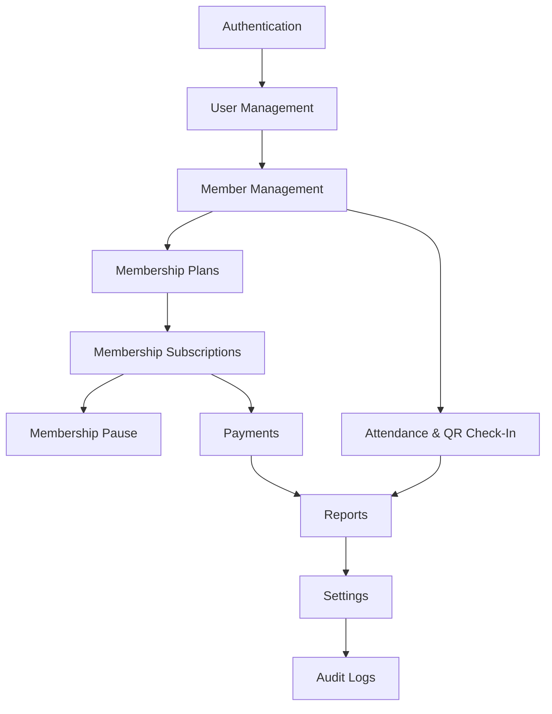

# Project Blueprint

This blueprint outlines the technical specifications, file organization, module relationships, operational risks, and design choices for the development of GymTrackPro.

---

## 📂 Folder Structure (Clean Architecture)

The repository is organized into distinct Clean Architecture layers under `src/` to facilitate code sharing and maintainability:

```directory
GymTrackPro/
├── docs/                      # Specification & developer logs
├── .github/                   # CI workflows, PR & issue templates
├── LICENSE                    # Repository License (MIT)
└── src/
    ├── GymTrackPro.Domain/         # Domain Layer (Entities, Value Objects, Domain Rules)
    ├── GymTrackPro.Application/    # Application Layer (Interfaces, DTOs, Use Cases, Validators)
    ├── GymTrackPro.Infrastructure/ # Infrastructure Layer (Data Access, Sync engine, Device API)
    ├── GymTrackPro.Shared/         # Shared Utilities (Enums, Constants, General helpers)
    ├── GymTrackPro.Server/         # Server Host (Web Host, API Controllers, Middleware)
    └── GymTrackPro.Client/         # Client Host (MAUI Presentation, Views, ViewModels)
```

---

## 🏗️ Project Architecture

```mermaid
graph TD
    subgraph Client Application (Mobile/Desktop)
        View[XAML View] <--> VM[ViewModel]
        VM <--> Serv[Client Service]
        Serv <--> RepoSQLite[SQLite Repo]
        RepoSQLite <--> SQLite[(SQLite Local DB)]
        Serv <--> Sync[Sync Coordinator]
    end

    subgraph Server Application (Web API Host)
        API[Web API Controllers] <--> ServAPI[Backend Service]
        ServAPI <--> RepoServer[Server DB Repo]
        RepoServer <--> ServerDB[(Central Server DB)]
    end

    Sync -- HTTPS REST (JWT) --> API
```

*   **View to ViewModel Binding:** All controls bind properties to ViewModels. ViewModels utilize commands to interact with Services.
*   **Service Isolation:** Services implement business validations and dispatch actions to repositories or syncer.
*   **Database Isolation:** Business logic is database-agnostic. Repositories deal with ORM layers on both sides.

---

## 💾 Database Overview

The system runs a **Central Server Database** as the core database and a **Local Client Database** locally.
*   *Candidates for Server DB:* MySQL, PostgreSQL, SQL Server (TBD in Phase 0).
*   *Candidates for Client DB:* SQLite, LiteDB (TBD in Phase 0).

### Schema Integrity & Sync Flags
To facilitate synchronization:
1.  **`LastModified`:** Every table except `Users` and `AuditLogs` contains a `LastModified` DATETIME field. This timestamp is generated on the client during creation or edits and is sent to the server to perform "Newest Update Wins" checks.
2.  **`SyncStatus` (Client DB only):** Local records contain a `SyncStatus` column (`Synced`, `Pending_Create`, `Pending_Update`, `Pending_Delete`).
3.  **`SyncQueue` (Client DB only):** Stores order of modifications to send upstream in sequence.

---

## 🔌 API Overview (RESTful)

All API endpoints require authorization, except the authentication routes.

| Endpoint | Method | Authentication | Payload | Output |
| :--- | :--- | :--- | :--- | :--- |
| `/api/auth/login` | POST | Anonymous | `{ Username, Password }` | `{ Token, UserInfo }` |
| `/api/members` | GET | Authorized | (Filter/Pagination Query) | `List<MemberDTO>` |
| `/api/members` | POST | Authorized | `CreateMemberDTO` | `MemberDTO` |
| `/api/subscriptions` | POST | Authorized | `CreateSubscriptionDTO` | `SubscriptionDTO` |
| `/api/payments` | POST | Authorized | `CreatePaymentDTO` | `PaymentDTO` |
| `/api/attendance/qr` | POST | Authorized | `{ QRCode }` | `AttendanceStatusDTO` |

---

## 🔗 Module Dependency Graph

This graph shows the order of dependencies, defining the order in which modules must be built.



---

## ⚠️ Risks & Technical Mitigations

### 1. Client Clock Drift
*   **Risk:** The conflict resolution engine relies on client `LastModified` timestamps. If a client device's system clock is manually changed, updates might be rejected or overwrite newer data erroneously.
*   **Mitigation:** The synchronization engine will query the API's server time during connection and compute an offset. This offset is used to normalize all local database timestamps before syncing.

### 2. Physical Database Drift
*   **Risk:** Differences in supported data types across local and server DBs can cause rounding errors or serialization crashes.
*   **Mitigation:** Repositories will map decimal columns to fixed-point integer fields (e.g., storing cents instead of decimals) to ensure compatibility across client and server.

### 3. Caching & Session Expiration Issues
*   **Risk:** Users log in, go offline, and then have their JWT expire before they reconnect, causing syncing to fail.
*   **Mitigation:** Provide sliding expiration tokens. Store a refresh token securely, and allow sync payloads to retry authentication once connectivity is restored.

---

## 💡 Suggested Improvements

1.  **NTP Synchronization:** Automatically synchronize the client application with an online NTP server (like `pool.ntp.org`) on launch to eliminate local time fraud.
2.  **JWT Refresh Tokens:** Use a sliding expiration session strategy. Issue access tokens with a 15-minute lifetime and long-lived refresh tokens securely saved offline.
3.  **Local SQLite Encryption:** Encrypt the local SQLite database using **SQLCipher** to prevent unauthorized users from viewing customer data directly from the device's storage.
