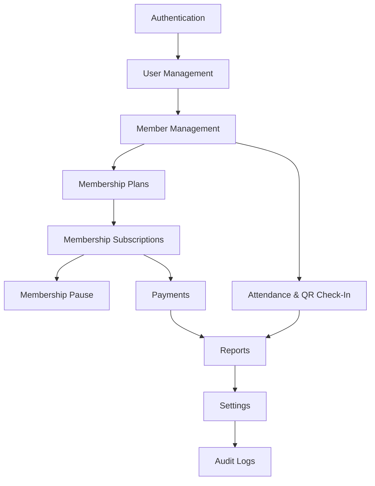

# Project Blueprint

This blueprint outlines the technical specifications, file organization, module relationships, operational risks, and design choices for the development of GymTrackPro.

---

## 📂 Folder Structure (Simplified Layering)

The repository is organized into exactly three projects under `src/` to facilitate code sharing and minimize referencing overhead:

```directory
GymTrackPro/
├── docs/                      # Specification, guidelines & developer logs
├── .github/                   # CI workflows, PR & issue templates
├── LICENSE                    # Repository License (MIT)
└── src/
    ├── GymTrackPro.Shared/    # Class Library: DTOs, Enums, Constants, Interfaces, Validators
    ├── GymTrackPro.API/       # Web API: Controllers, Services, EF Core Repositories, SQL Server DbContext
    └── GymTrackPro.Mobile/    # .NET MAUI Client: Views, ViewModels, SQLite local repositories
```

### 1. `GymTrackPro.Shared` Project Layout
```directory
GymTrackPro.Shared/
├── DTOs/                 # Data transfer contracts (AuthRequest, MemberResponse, etc.)
├── Models/               # Client/Server shared entity models (with basic annotations)
├── Interfaces/           # Shared service and repository contracts (IMemberRepository, etc.)
├── Enums/                # Global enums (UserRole, MembershipStatus, PaymentMethod)
├── Constants/            # Magic strings, configuration keys, error messages
├── Validators/           # FluentValidation rules (or annotation attributes)
└── Helpers/              # Shared helper classes (DateTime formatting, text cleaners)
```

### 2. `GymTrackPro.API` Project Layout
```directory
GymTrackPro.API/
├── Controllers/          # REST endpoints (AuthController, MembersController)
├── Services/             # Business Logic (AuthService, MemberService)
├── Repositories/         # Database persistence using EF Core (SQL Server)
├── Data/                 # EF DbContext (GymDbContext.cs)
├── Authentication/       # JWT token generators and custom authorization handlers
├── Middleware/           # Global error handler and logger
└── Program.cs            # API bootstrap and Dependency Injection registrations
```

### 3. `GymTrackPro.Mobile` Project Layout
```directory
GymTrackPro.Mobile/
├── Views/                # XAML Pages (LoginPage.xaml, MembersPage.xaml)
├── ViewModels/           # CommunityToolkit.Mvvm ViewModels
├── Services/             # Client-specific services (SyncService, ConnectivityMonitor)
├── Repositories/         # SQLite read/write data access
├── Controls/             # Custom UI widgets (QR Scanner View, status bars)
├── Converters/           # XAML value converters
├── Resources/            # Styles, Colors, and Fonts assets
└── AppShell.xaml         # Application shell navigation
```

---

## 🏗️ Project Architecture

```mermaid
graph TD
    subgraph Client Application (Mobile/Desktop)
        View[XAML View] <--> VM[ViewModel]
        VM <--> Serv[Client Service]
        Serv <--> RepoSQLite[SQLite Repo]
        RepoSQLite <--> SQLite[(SQLite Local DB)]
        Serv <--> Sync[Sync Coordinator]
    end

    subgraph Server Application (Web API Host)
        API[Web API Controllers] <--> ServAPI[Backend Service]
        ServAPI <--> RepoServer[EF Core Repo]
        RepoServer <--> SQLServer[(SQL Server MonsterASP)]
    end

    Sync -- HTTPS REST (JWT) --> API
    GymTrackPro.Mobile -- References --> GymTrackPro.Shared
    GymTrackPro.API -- References --> GymTrackPro.Shared
```

---

## 💾 Database Overview

The system runs **SQL Server** hosted on MonsterASP as the central database and **SQLite** locally.

### Schema Integrity & Sync Flags
To facilitate synchronization:
1.  **`LastModified`:** Every table except `Users` and `AuditLogs` contains a `LastModified` DATETIME field. This timestamp is generated on the client during creation or edits and is sent to the server to perform "Newest Update Wins" checks.
2.  **`SyncStatus` (Client DB only):** Local records contain a `SyncStatus` column (`Synced`, `Pending_Create`, `Pending_Update`, `Pending_Delete`).
3.  **`SyncQueue` (Client DB only):** Stores order of modifications to send upstream in sequence.

---

## 🔌 API Overview (RESTful)

All API endpoints require authorization, except the authentication routes.

| Endpoint | Method | Authentication | Payload | Output |
| :--- | :--- | :--- | :--- | :--- |
| `/api/auth/login` | POST | Anonymous | `{ Username, Password }` | `{ Token, UserInfo }` |
| `/api/members` | GET | Authorized | (Filter/Pagination Query) | `List<MemberDTO>` |
| `/api/members` | POST | Authorized | `CreateMemberDTO` | `MemberDTO` |
| `/api/subscriptions` | POST | Authorized | `CreateSubscriptionDTO` | `SubscriptionDTO` |
| `/api/payments` | POST | Authorized | `CreatePaymentDTO` | `PaymentDTO` |
| `/api/attendance/qr` | POST | Authorized | `{ QRCode }` | `AttendanceStatusDTO` |

---

## 🔗 Module Dependency Graph

This graph shows the order of dependencies, defining the order in which modules must be built.



---

## ⚠️ Risks & Technical Mitigations

### 1. Client Clock Drift
*   **Risk:** The conflict resolution engine relies on client `LastModified` timestamps. If a client device's system clock is manually changed, updates might be rejected or overwrite newer data erroneously.
*   **Mitigation:** The synchronization engine will query the API's server time during connection and compute an offset. This offset is used to normalize all local database timestamps before syncing.

### 2. SQLite Date compatibility
*   **Risk:** SQL Server stores dates natively with milliseconds precision. SQLite stores dates as strings or integers, which can lead to parsing errors during synchronization.
*   **Mitigation:** Set explicit EF Core column formatting and ensure that SQLite repositories utilize UTC ISO-8601 strings (`yyyy-MM-dd HH:mm:ss.fff`) for storage and parsing.

### 3. Caching & Session Expiration Issues
*   **Risk:** Users log in, go offline, and then have their JWT expire before they reconnect, causing syncing to fail.
*   **Mitigation:** Store a refresh token securely in SecureStorage, and allow sync payloads to retry authentication once connectivity is restored.
