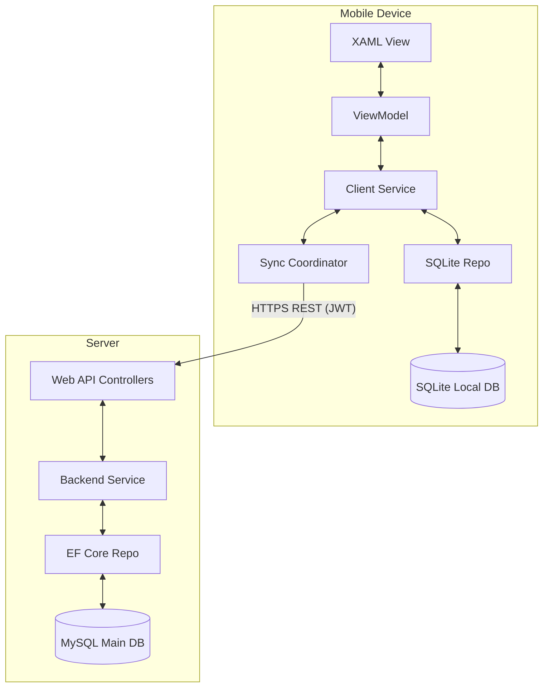
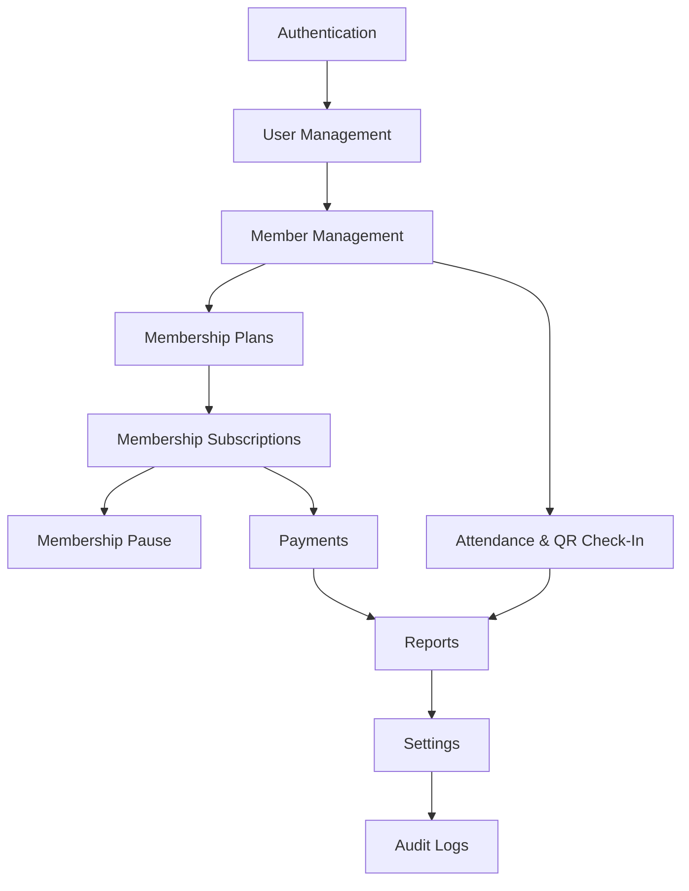

# Project Blueprint

This blueprint outlines the technical specifications, file organization, module relationships, operational risks, and design choices for the development of GymTrackPro.

---

## 📂 Folder Structure

The repository is divided into the Backend API (`api/`) and the Mobile Client (`mobile/`). Common domain classes and helpers can be placed in `src/`.

### 1. Backend Web API Layout (`api/GymTrackPro.API`)
```directory
GymTrackPro.API/
├── Controllers/         # REST API endpoints (Auth, Members, Payments, etc.)
├── Services/            # Business rule execution (MemberService, PaymentService)
├── Repositories/        # Database read/write logic using EF Core
│   └── Interfaces/      # Data access contracts (IMemberRepository, etc.)
├── Models/              # Database entities mapping directly to MySQL tables
├── DTOs/                # Data Transfer Objects (Request/Response schemas)
├── Middleware/          # Global error handling and JWT authentication parser
├── Data/                # EF Core Database Context (GymDbContext.cs)
├── Configurations/      # Model configuration configurations (fluent API)
├── Migrations/          # EF Core database migrations
└── Program.cs           # Web host configuration & dependency injection setup
```

### 2. Mobile App Layout (`mobile/GymTrackPro.Mobile`)
```directory
GymTrackPro.Mobile/
├── Views/               # XAML Page UI definitions
├── ViewModels/          # Data binding and commands (MVVM)
├── Models/              # Client-side entities mapping to SQLite tables
├── Services/            # Client logic (SyncService, ConnectivityService, AuthService)
├── Repositories/        # SQLite operations using SQLite-net ORM
│   └── Interfaces/      # Local repository contracts
├── DTOs/                # API communication contracts
├── Data/                # Local database initialization (LocalDbContext.cs)
├── Sync/                # Sync Queue, background workers, and conflict handlers
├── Controls/            # Reusable UI controls (Custom headers, buttons)
├── Converters/          # XAML data converters
├── Validators/          # Form input validation classes
└── AppShell.xaml        # Global navigation shell
```

---

## 🏗️ Project Architecture



*   **View to ViewModel Binding:** All controls bind properties to ViewModels. ViewModels utilize commands (e.g. `CheckInCommand`) to interact with Services.
*   **Service Isolation:** Services implement business validations (e.g., verifying if a membership plan is expired) and dispatch actions to repositories or syncer.
*   **Database Isolation:** Business logic is database-agnostic. Repositories deal with EF Core (MySQL) or SQLite-net ORM (SQLite).

---

## 💾 Database Overview

The system runs a **MySQL** engine as the core database and **SQLite** locally. SQLite is lightweight and is compiled directly into the application, requiring zero network overhead.

### Schema Integrity & Sync Flags
To facilitate synchronization:
1.  **`LastModified`:** Every table except `Users` and `AuditLogs` contains a `LastModified` DATETIME field. This timestamp is generated on the client during creation or edits and is sent to the server to perform "Newest Update Wins" checks.
2.  **`SyncStatus` (SQLite only):** Local records contain a `SyncStatus` column (`Synced`, `Pending_Create`, `Pending_Update`, `Pending_Delete`).
3.  **`SyncQueue` (SQLite only):** Stores order of modifications to send upstream in sequence.

---

## 🔌 API Overview

All API endpoints require a `Bearer <token>` HTTP Authorization header, except the authentication routes.

| Endpoint | Method | Authentication | Payload | Output |
| :--- | :--- | :--- | :--- | :--- |
| `/api/auth/login` | POST | Anonymous | `{ Username, Password }` | `{ Token, UserInfo }` |
| `/api/members` | GET | Authorized | (Filter/Pagination Query) | `List<MemberDTO>` |
| `/api/members` | POST | Authorized | `CreateMemberDTO` | `MemberDTO` |
| `/api/subscriptions` | POST | Authorized | `CreateSubscriptionDTO` | `SubscriptionDTO` |
| `/api/payments` | POST | Authorized | `CreatePaymentDTO` | `PaymentDTO` |
| `/api/attendance/qr` | POST | Authorized | `{ QRCode }` | `AttendanceStatusDTO` |

---

## 🔗 Module Dependency Graph

This graph shows the order of dependencies, defining the order in which modules must be built.



---

## ⚠️ Risks & Technical Mitigations

### 1. Client Clock Drift
*   **Risk:** The conflict resolution engine relies on client `LastModified` timestamps. If a client device's system clock is manually changed, updates might be rejected or overwrite newer data erroneously.
*   **Mitigation:** The synchronization engine will query the API's server time during connection and compute an offset. This offset is used to normalize all local database timestamps before syncing.

### 2. Schema Drift Between SQLite & MySQL
*   **Risk:** Differences in supported data types (e.g. MySQL `DECIMAL` vs. SQLite `REAL`/floating-point, or native date types) can cause data rounding errors or serialization crashes.
*   **Mitigation:** Repositories will map decimal columns to string or fixed-point integer fields (e.g., storing cents instead of decimals) to ensure compatibility across SQLite and MySQL.

### 3. Synchronization Congestion (Large Files)
*   **Risk:** Uploading large profile pictures during sync can block database transactions and cause timeouts on slow connections.
*   **Mitigation:** Profile images must be compressed (JPEG, max width 400px) and saved as local files on the device, with only the path or a base64-compressed thumbnail synced to the server.

### 4. Concurrent Sessions Offline
*   **Risk:** If multiple receptionists share a tablet offline, they can overwrite each other's updates once they reconnect.
*   **Mitigation:** The sync payloads include the `UserID` of the modifier, and the conflict resolution updates the `AuditLogs` so changes are traceably associated with the correct accounts.

---

## 💡 Suggested Improvements

1.  **NTP Synchronization:** Automatically synchronize the mobile application with an online NTP server (like `pool.ntp.org`) on launch to eliminate local time fraud.
2.  **JWT Refresh Tokens:** Use a sliding expiration session strategy. Issue access tokens with a 15-minute lifetime and long-lived refresh tokens securely saved offline.
3.  **Local SQLite Encryption:** Encrypt the local SQLite database using **SQLCipher** to prevent unauthorized users from viewing customer data directly from the device's storage.
