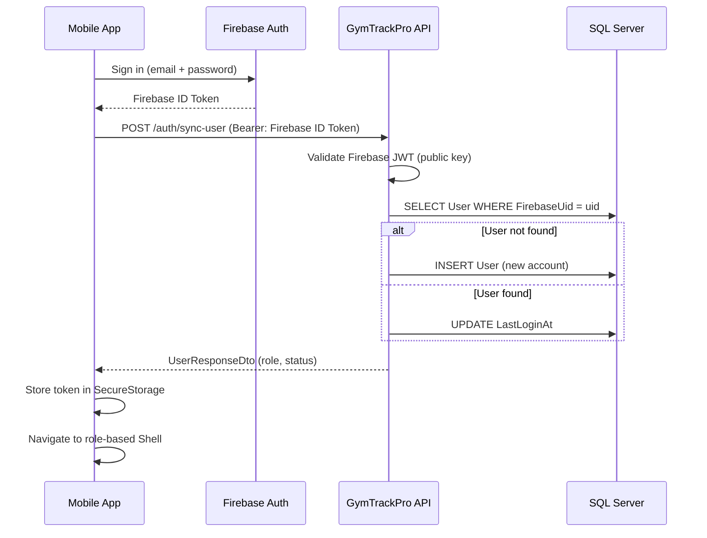
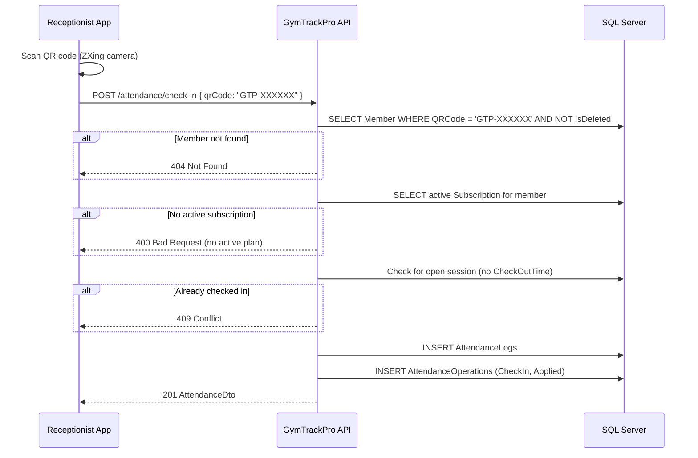
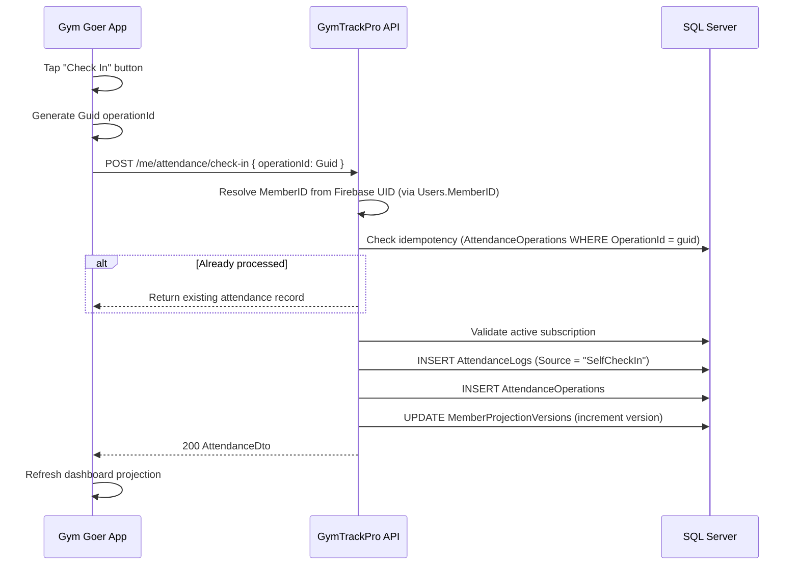
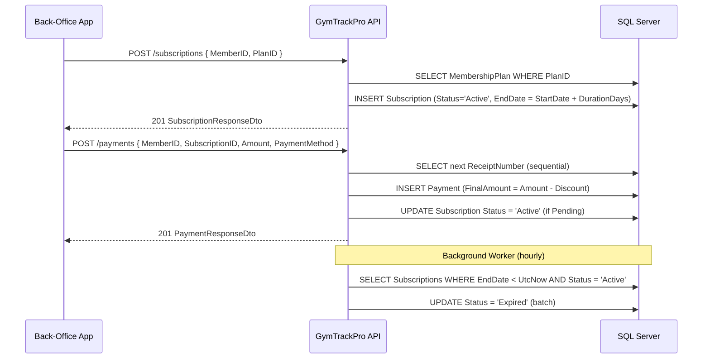
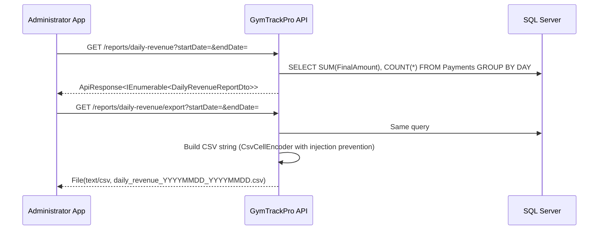

# GymTrackPro — System Flow & Use Cases

## Use Case Diagram (Mermaid)

```mermaid
graph TD
    Admin([Administrator])
    Recep([Receptionist])
    Goer([Gym Goer / Member])

    Admin --> UC1[Manage Members]
    Admin --> UC2[Manage Membership Plans]
    Admin --> UC3[Manage Subscriptions]
    Admin --> UC4[Process Payments]
    Admin --> UC5[Refund Payment]
    Admin --> UC6[View Reports & Export CSV]
    Admin --> UC7[Manage System Settings]
    Admin --> UC8[Check In / Out Members]
    Admin --> UC9[Void Attendance]
    Admin --> UC10[Correct Checkout]
    Admin --> UC11[Generate App Invite for Member]
    Admin --> UC12[Manage Notifications]
    Admin --> UC13[View Dashboard KPIs]

    Recep --> UC1
    Recep --> UC3
    Recep --> UC4
    Recep --> UC8
    Recep --> UC11
    Recep --> UC12
    Recep --> UC13

    Goer --> UC14[Login via Firebase]
    Goer --> UC15[View Personal Dashboard]
    Goer --> UC16[Self Check-In]
    Goer --> UC17[Self Check-Out]
    Goer --> UC18[View Attendance History]
    Goer --> UC19[View Digital Membership Card]
    Goer --> UC20[View Progress & Badges]
```

---

## System Flow Diagrams

### Authentication Flow

---

### Staff-Side Check-In Flow

---

### Gym Goer Self Check-In Flow

---

### Subscription & Payment Flow

---

### Report Generation Flow

---

## Use Case Descriptions

### UC-01: Create Member
- **Actor:** Administrator, Receptionist
- **Precondition:** User is authenticated with `BackOffice` policy
- **Steps:**
  1. Staff fills out member registration form
  2. App calls `POST /api/v1/members`
  3. API validates uniqueness of PhoneNumber and Email
  4. API generates unique QR code (`GTP-` prefix + 6 alphanumeric characters)
  5. If profile picture provided (base64), saves to server filesystem
  6. Member record created in DB
- **Postcondition:** New member appears in member list with `Status = Active`
- **Exceptions:** Duplicate phone or email → 400 Bad Request

---

### UC-02: Check In Member (Staff)
- **Actor:** Administrator, Receptionist
- **Precondition:** Member exists, member has active subscription
- **Steps:**
  1. Staff opens Attendance screen and scans QR code via camera (ZXing)
  2. App sends QR code to `POST /api/v1/attendance/check-in`
  3. API validates QR → Member → Active subscription
  4. API checks for existing open session
  5. Creates attendance log
- **Exceptions:** No active subscription → error; already checked in → error

---

### UC-03: Self Check-In (Gym Goer)
- **Actor:** Gym Goer (member with linked account)
- **Precondition:** GymGoer is logged in, has active subscription
- **Steps:**
  1. Member taps "Check In" on GoerDashboardPage
  2. App generates idempotent operation GUID
  3. App calls `POST /api/v1/me/attendance/check-in`
  4. API resolves member from Firebase UID
  5. Validates active subscription, no open session
  6. Creates attendance record
  7. Increments MemberProjectionVersion
- **Postcondition:** Dashboard shows "Checked In" state

---

### UC-04: Process Payment
- **Actor:** Administrator, Receptionist
- **Precondition:** Member has subscription, subscription is active or pending
- **Steps:**
  1. Staff records payment on PaymentsPage
  2. App calls `POST /api/v1/payments`
  3. API generates sequential receipt number
  4. Calculates FinalAmount = Amount − Discount
  5. Saves payment record
  6. Logs audit event
- **Postcondition:** Payment appears in member's payment history

---

### UC-05: Refund Payment
- **Actor:** Administrator only
- **Precondition:** Payment has `Status = Paid`
- **Steps:**
  1. Admin taps Refund on payment record
  2. App calls `POST /api/v1/payments/{id}/refund`
  3. API sets `PaymentStatus = Refunded`
  4. API sets linked subscription `Status = Cancelled`
  5. Audit log written
- **Postcondition:** Payment shows Refunded; subscription shows Cancelled

---

### UC-06: Generate Gym Goer App Invite
- **Actor:** Administrator, Receptionist
- **Precondition:** Member exists and has no active invite
- **Steps:**
  1. Staff opens Member Details and taps "Generate App Invite"
  2. Staff enters the member's email address
  3. App calls `POST /api/v1/members/{id}/app-invite`
  4. API creates `AccountInvite` with hashed token, sets 24-hour expiry
  5. Invite code displayed on screen (plaintext, one-time view)
  6. Staff shares code with member
  7. Member downloads app, registers with Firebase, enters code
  8. App calls `POST /api/v1/auth/activate`
  9. Firebase UID linked to member's `User` record with `GymGoer` role
- **Postcondition:** Member can log in to the GymGoer shell

---

### UC-07: View Dashboard (Admin/Receptionist)
- **Actor:** Administrator, Receptionist
- **Steps:**
  1. App loads DashboardPage on login
  2. Calls `GET /api/v1/dashboard/metrics`
  3. API returns: total active members, today's check-ins, monthly revenue, memberships expiring within 7 days
- **Output:** KPI metrics cards on dashboard

---

### UC-08: View Gym Goer Dashboard
- **Actor:** Gym Goer
- **Steps:**
  1. GoerDashboardPage loads on login
  2. App calls `GET /api/v1/me/dashboard`
  3. API runs `GymGoerProjectionService` — calculates:
     - Current membership status
     - Current open session
     - Monthly workout minutes and duration in seconds
     - Visit count
     - Current streak and longest streak
     - Badge eligibility (derived from implementation)
  4. Returns `GoerDashboardDto` with `ProjectionMetadataDto` (version, ETag, freshness)
- **Output:** Dashboard showing progress, session status, and achievements

---

### UC-09: Generate Reports
- **Actor:** Administrator only
- **Steps:**
  1. Admin selects report type and date range on ReportsPage
  2. App calls appropriate report endpoint
  3. Response displayed as list
  4. Optionally, Admin taps Export → App calls `/export` variant
  5. CSV file saved to device
