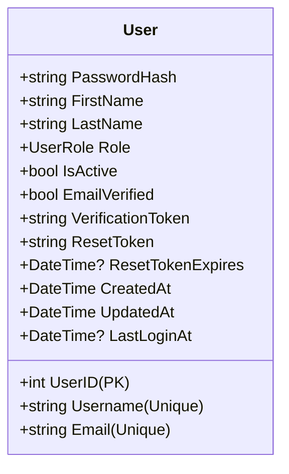

# Authentication & Identity Architecture

This document describes the design, flows, and security guidelines for the authentication and identity system of the GymTrackPro platform.

---

## 1. Business Rules

*   **Credential Uniqueness**: Each user must register with a unique username and a unique email address.
*   **Password Complexity Policy**: Passwords must meet these strength requirements:
    *   Minimum 8 characters.
    *   At least one uppercase letter (`A-Z`).
    *   At least one lowercase letter (`a-z`).
    *   At least one numeric digit (`0-9`).
    *   At least one special character (e.g. `@`, `#`, `$`, `%`, etc.).
*   **Hash Strength**: Cleartext passwords are never stored. Passwords are salted and hashed using BCrypt.Net with a cost factor of 11.
*   **Account Locking/Status**: Only users marked as active (`IsActive = true`) may authenticate.
*   **Email Verification Policy**: Users with unverified emails (`EmailVerified = false`) are blocked from logging in.
*   **Token Expiration Rules**:
    *   JWT Access Token: Expires 24 hours after issuance.
    *   Password Reset Token: Expires 2 hours after generation.

---

## 2. API Contract

### 2.1 Endpoints List
*   `POST /api/v1/auth/register` (Anonymous) - Register a new receptionist user.
*   `POST /api/v1/auth/verify-email` (Anonymous) - Verify email via token.
*   `POST /api/v1/auth/login` (Anonymous) - Authenticate and retrieve JWT token.
*   `POST /api/v1/auth/forgot-password?email={email}` (Anonymous) - Request reset link.
*   `POST /api/v1/auth/reset-password` (Anonymous) - Perform password reset using token.

### 2.2 Request/Response Data Shapes

#### Register Request (`RegisterUserDto`)
```json
{
  "username": "john_doe",
  "email": "john@gymtrack.pro",
  "password": "SecurePassword@123",
  "firstName": "John",
  "lastName": "Doe"
}
```

#### Login Request (`LoginDto`)
```json
{
  "username": "john_doe",
  "password": "SecurePassword@123"
}
```

#### Login Success Response (`ApiResponse<UserResponseDto>`)
```json
{
  "success": true,
  "message": "Login successful.",
  "data": {
    "userID": 1,
    "username": "john_doe",
    "email": "john@gymtrack.pro",
    "firstName": "John",
    "lastName": "Doe",
    "role": "Receptionist",
    "token": "eyJhbGciOiJIUzI1NiIsInR5cCI6IkpXVCJ9..."
  },
  "errors": []
}
```

---

## 3. Data Model

### 3.1 User Entity (`Users` Table)



---

## 4. Security

*   **Role-Based Access Control (RBAC)**: Supported roles are:
    *   `0`: `Administrator`
    *   `1`: `Receptionist`
*   **JWT Claims Structure**:
    *   `NameIdentifier` (`sub`): Database `UserID`.
    *   `Name` (`unique_name`): `Username`.
    *   `Email`: User's primary email.
    *   `Role`: `Administrator` or `Receptionist`.
*   **Secure Client Storage**: JWT access tokens are saved in platform-specific secure storage API (`SecureStorage` on MAUI/mobile).

---

## 5. Integration Points

*   **Audit Service (`IAuditService`)**: Logs all authentication outcomes (successes, incorrect password failures, unverified blocks, reset requests).
*   **Firebase / SMTP Email Service**: Dispatches email verification and password reset tokens to users.

---

## 6. Testing Coverage

The `auth_integration_test.ps1` test suite validates the following scenarios:
1.  **Register User**: Successful registration of a receptionist.
2.  **Duplicate Username/Email Rejection**: Enforces validation bounds on database level.
3.  **Invalid Login Credentials**: Rejects bad passwords.
4.  **Unverified Account Block**: Prevents logins prior to email validation.
5.  **Token Verification**: Confirms email verification tokens are matched correctly.
6.  **Password Reset Flow**: Exercises forgot-password token generation and reset password validation.

---

## 7. Known Limitations

*   **Token Revocation**: No token blacklisting (blocklist/refresh token database table) is currently implemented. If a JWT token is compromised, it remains valid until the 24-hour expiration duration is met.
*   **SMTP Service Integration**: In local/dev environments, email transmissions are simulated and verification tokens are directly verified using test-runner overrides.
