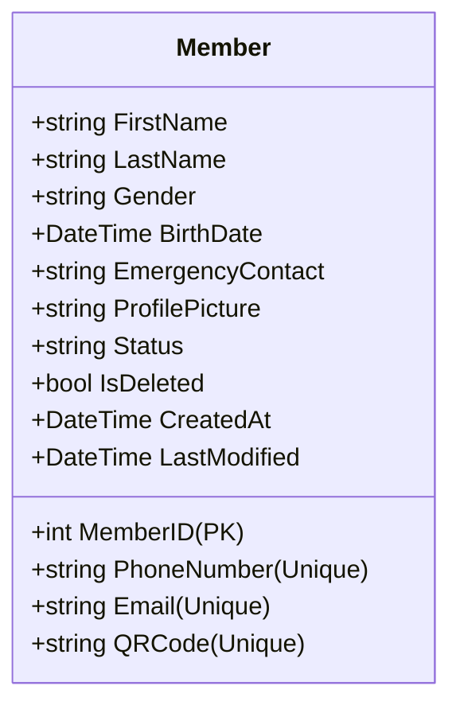

# Member Management Architecture

This document describes the design, flows, and security guidelines for the Member Management system of the GymTrackPro platform.

---

## 1. Business Rules

*   **Identifier Uniqueness**: Phone number, email address, and generated QR code check-in strings must be globally unique across the database.
*   **QR Code Structure**: Membership QR check-in codes must match the format `GTP-{PART_OF_GUID}` (e.g. `GTP-A7B8C9D012`) to allow simple scanning validation.
*   **Profile Picture Support**: Base64 strings sent by clients are decoded and written to the filesystem at `wwwroot/uploads/profiles/`. Stale/superseded profile photos are deleted from disk during member updates.
*   **Soft Delete Requirement**: Members cannot be permanently deleted (to preserve historical payment logs). Deletion flips the `IsDeleted` boolean flag to `true`.
*   **Active Status**: Members can have statuses of `Active`, `Inactive`, or `Blocked`.
*   **Query Boundaries**: All read actions (retrieval by ID, searching, paginated lists) automatically filter out records where `IsDeleted` is `true`.

---

## 2. API Contract

### 2.1 Endpoints List
*   `GET /api/v1/Members/search` (Authorized) - Paginated search and status filter.
*   `GET /api/v1/Members/{id}` (Authorized) - Retrieve member details by primary ID.
*   `GET /api/v1/Members/qr/{qrCode}` (Authorized) - Retrieve member details by QR code.
*   `POST /api/v1/Members` (Authorized) - Register a new member.
*   `PUT /api/v1/Members/{id}` (Authorized) - Modify an existing member's profile.
*   `DELETE /api/v1/Members/{id}` (Restricted: Admin Only) - Soft-delete member record.

### 2.2 Request/Response Data Shapes

#### Create Member Request (`CreateMemberDto`)
```json
{
  "firstName": "Alice",
  "lastName": "Smith",
  "gender": "Female",
  "birthDate": "1995-05-15T00:00:00Z",
  "phoneNumber": "+1234567890",
  "email": "alice@example.com",
  "emergencyContact": "Contact: +1999999999",
  "profilePictureBase64": "data:image/jpeg;base64,/9j/4AAQSkZJRgABA..."
}
```

#### Paginated Search Response (`ApiResponse<PagedResultDto<MemberResponseDto>>`)
```json
{
  "success": true,
  "message": "Members retrieved successfully.",
  "data": {
    "items": [
      {
        "memberID": 1,
        "firstName": "Alice",
        "lastName": "Smith",
        "gender": "Female",
        "birthDate": "1995-05-15T00:00:00",
        "phoneNumber": "+1234567890",
        "email": "alice@example.com",
        "emergencyContact": "Contact: +1999999999",
        "profilePicture": "/uploads/profiles/a8b8c9d0.jpg",
        "status": "Active",
        "qrCode": "GTP-A7B8C9D012",
        "createdAt": "2026-07-02T01:00:00"
      }
    ],
    "totalCount": 1,
    "pageSize": 10,
    "currentPage": 1,
    "totalPages": 1
  },
  "errors": []
}
```

---

## 3. Data Model

### 3.1 Member Entity (`Members` Table)



---

## 4. Security

*   **Role-Based Access Control (RBAC)**:
    *   **Delete**: Strict validation requires the `Administrator` role (`[Authorize(Roles = "Administrator")]`). Attempts by `Receptionist` fail with a `403 Forbidden` response.
    *   **Create/Read/Update**: Open to both `Administrator` and `Receptionist` roles.

---

## 5. Integration Points

*   **Local Filesystem**: Writes decoded image files directly to the server's local path (`wwwroot/uploads/profiles/`).
*   **Audit Service (`IAuditService`)**: Records security audit logs on `Member Created`, `Member Updated`, and `Member Deleted` actions.

---

## 6. Testing Coverage

The `members_integration_test.ps1` test suite validates the following scenarios:
1.  **Create Member**: Registers a new member profile and parses the profile photo.
2.  **Duplicate Rejection**: Ensures emails and phone numbers cannot be registered twice.
3.  **Lookup & Queries**: Retrieves profiles by ID or QR code checks.
4.  **Paginated Search**: Filters list by name, phone, and active status checks.
5.  **Profile Update**: Saves edits, processes modified photos, and blocks duplicate numbers.
6.  **Soft Delete RBAC Rules**: Restricts delete requests to Administrators and asserts that soft-deleted items return 404 on subsequent queries.
7.  **Audit Logs**: Asserts database entries are updated on Member life cycle events.

---

## 7. Known Limitations

*   **Filesystem Binding**: Local file storage makes the API stateful. If scaled out horizontally across multiple instances (e.g. Docker swarm or Kubernetes), images would not be synchronized unless a shared volume or cloud blob storage (S3/Azure Blob) is configured.
*   **Image Compression**: Profile pictures are saved as-is without resizing or format optimizations, which could consume significant disk space over time.
