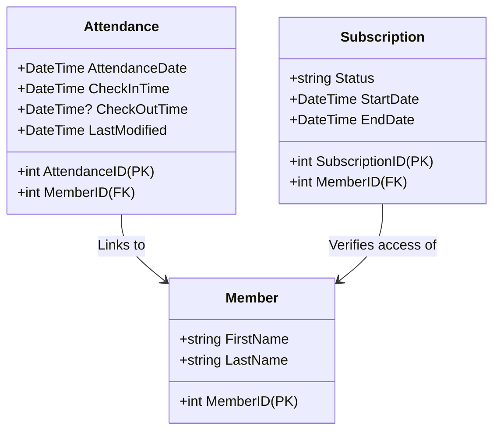

# Attendance & Check-In Architecture

This document describes the design, business rules, and integration workflows for the GymTrackPro Attendance & QR Check-In module.

---

## 1. Business Rules

*   **Active Membership Validation (BR-01)**:
    *   A member's check-in attempt will be rejected if they do not have a valid, active subscription.
    *   A subscription is considered valid if and only if `Status == "Active"`, `StartDate <= Today`, and `EndDate >= Today`.
    *   Failed check-in attempts trigger a `CheckIn Failure` event in the audit trail.
*   **Check-In Controls & Limits (BR-02)**:
    *   **Active Session Lock**: Members cannot check in if they are already checked in (meaning there is an open attendance record where `CheckOutTime == null`).
    *   **Daily Check-In Limit**: To protect against pass sharing, members are limited to exactly 1 check-in per calendar day (UTC). Checking out does not reset this daily limit.
*   **Checkout Validation**: Checkouts are only allowed on open sessions (`CheckOutTime == null`). Duplicate checkout attempts are rejected.

---

## 2. API Contract

### 2.1 Endpoints List
*   `GET /api/v1/Attendance/{id}` (Authorized) - Retrieve an attendance log by ID.
*   `GET /api/v1/Attendance/member/{memberId}` (Authorized) - Get check-in logs for a member.
*   `POST /api/v1/Attendance/checkin` (Authorized) - Process QR check-in using code payload.
*   `POST /api/v1/Attendance/{id}/checkout` (Authorized) - Register check-out timestamp.

### 2.2 Request/Response Data Shapes

#### Check-In Request (Raw Body string)
```json
"GTP-A7B8C9D012"
```

#### Check-In Success Response (`ApiResponse<AttendanceDto>`)
```json
{
  "success": true,
  "message": "Checked in successfully.",
  "data": {
    "attendanceID": 5,
    "memberID": 1,
    "memberName": "Alice Smith",
    "attendanceDate": "2026-07-02T00:00:00",
    "checkInTime": "2026-07-02T01:05:00Z",
    "checkOutTime": null,
    "lastModified": "2026-07-02T01:05:00Z"
  },
  "errors": []
}
```

---

## 3. Data Model

### 3.1 Attendance Entity (`AttendanceLogs` Table)



---

## 4. Security

*   **Role-Based Access Control (RBAC)**:
    *   Both `Administrator` and `Receptionist` roles are authorized to run check-ins, register checkouts, and retrieve logs.
*   **User Identification**: Uses ASP.NET Core `HttpContextAccessor` name claim (`NameIdentifier`) to resolve the cashier or receptionist registering the check-in/out.

---

## 5. Integration Points

*   **Member Repository (`IMemberRepository`)**: Resolves scanned check-in codes to member records.
*   **Subscription Repository (`ISubscriptionRepository`)**: Checks date validity and status of plans.
*   **Audit Service (`IAuditService`)**: Registers system-wide check-in logs and deconstruction errors.

---

## 6. Testing Coverage

The `attendance_integration_test.ps1` test suite validates the following scenarios:
1.  **Check-In Valid Member**: Checks in a member with an active subscription.
2.  **Duplicate Check-In Lock**: Blocks check-in if there is an active session (not checked out).
3.  **Valid Check-Out**: Successfully registers check-out.
4.  **Double Check-Out Block**: Prevents redundant check-out calls.
5.  **Daily Limit Block**: Prevents a second check-in on the same day even after checking out.
6.  **Expired Subscription Block**: Rejects check-ins if the subscription end date is in the past.
7.  **No Subscription Block**: Rejects members without a subscription.
8.  **Invalid Code**: Responds with 404 on bad QR code strings.
9.  **Audit trail**: Validates that all events are recorded.

---

## 7. Known Limitations

*   **Timezone Dependency**: The daily check-in limit is computed using UTC timezone (`DateTime.UtcNow.Date`). If the local gym operates in a different timezone (e.g. UTC+8), calendar roll-over occurs at a different local time, which could temporarily affect late-night check-ins.
*   **Manual Checkout Requirement**: If a member forgets to check out, the session remains open, preventing them from checking in the next day until staff manually checks them out.

---

## 8. Mobile Client Integration

*   **Live QR Scanner**: The .NET MAUI mobile app utilizes `ZXing.Net.Maui` to provide a live camera feed on the Attendance Page. Staff can scan member QR codes directly, which automatically populates the input field and triggers the check-in command. Appropriate camera permissions (`android.permission.CAMERA` and `NSCameraUsageDescription`) are configured for Android and iOS.
