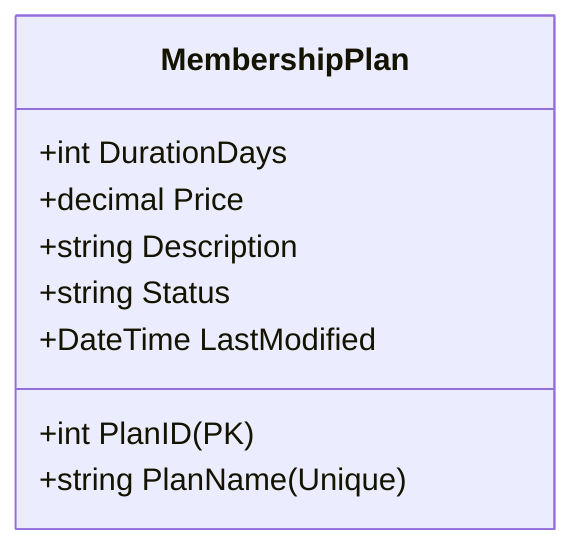

# Membership Plans Architecture

This document describes the design, business rules, and integration workflows for the GymTrackPro Membership Plans module.

---

## 1. Business Rules

*   **Plan Name Uniqueness**: Each membership plan must have a unique `PlanName`. Creation or updates attempting to reuse an existing plan name are rejected with an `ArgumentException`.
*   **Positive Duration and Price**: Plan pricing must be a positive decimal, and duration must be at least 1 day.
*   **Deactivation Soft-Delete**: Membership plans are never permanently removed from the database to preserve historical relationship integrity (e.g. for members currently active on a plan). Deleting a plan updates its `Status` to `Inactive`.
*   **Pricing Precision**: Plan prices are stored with standard financial precision of two decimal places (`decimal(18,2)`).

---

## 2. API Contract

### 2.1 Endpoints List
*   `GET /api/v1/Plans` (Authorized) - Retrieve all active plans.
*   `GET /api/v1/Plans/{id}` (Authorized) - Retrieve plan details by ID.
*   `POST /api/v1/Plans` (Restricted: Admin Only) - Create a new membership plan.
*   `PUT /api/v1/Plans/{id}` (Restricted: Admin Only) - Update membership plan details.
*   `DELETE /api/v1/Plans/{id}` (Restricted: Admin Only) - Mark a membership plan as `Inactive`.

### 2.2 Request/Response Data Shapes

#### Create/Update Request (`CreateMembershipPlanDto`)
```json
{
  "planName": "Standard Monthly",
  "durationDays": 30,
  "price": 49.99,
  "description": "Access to all gym amenities and lockers."
}
```

#### Success Response (`ApiResponse<MembershipPlanResponseDto>`)
```json
{
  "success": true,
  "message": "Membership plan created successfully.",
  "data": {
    "planID": 1,
    "planName": "Standard Monthly",
    "durationDays": 30,
    "price": 49.99,
    "description": "Access to all gym amenities and lockers.",
    "status": "Active",
    "lastModified": "2026-07-02T01:10:00Z"
  },
  "errors": []
}
```

---

## 3. Data Model

### 3.1 MembershipPlan Entity (`MembershipPlans` Table)



---

## 4. Security

*   **Role-Based Access Control (RBAC)**:
    *   **GET (Read)**: Accessible to both `Administrator` and `Receptionist` roles.
    *   **POST/PUT/DELETE (Write/Modify)**: Exclusively restricted to the `Administrator` role (`[Authorize(Roles = "Administrator")]`).

---

## 5. Integration Points

*   **Subscription Module**: Serves as the core lookup definition for generating new member subscriptions.
*   **Audit Service (`IAuditService`)**: Registers administrative events when plans are created, updated, or deactivated.

---

## 6. Testing Coverage

The integration scenarios verify:
1.  **Plan Creation**: Registers a new active plan.
2.  **Duplicate Rejection**: Rejects plan creation attempts that duplicate an existing `PlanName`.
3.  **Plan Update**: Saves modified details (e.g. price, description) and checks name uniqueness against other records.
4.  **Soft-Deactivation**: Assets that deleting a plan sets its status to `Inactive` and does not erase it from the database.
5.  **Role Restriction Check**: Verifies that a `Receptionist` token is rejected with `403 Forbidden` on create, update, or delete commands.

---

## 7. Known Limitations

*   **Price Updates and Active Subscriptions**: Changing the price of an existing plan applies only to new subscriptions. Existing active subscriptions retain their original historical checkout and payment terms.

---

## 8. Architecture Decisions

*   **Why Soft Deactivation instead of Hard Delete?**
    *   *Decision*: Hard deleting a membership plan would violate database foreign key constraints for active or past member subscriptions. Setting the status to `Inactive` hides it from new registration lookups while maintaining history.
*   **Why Repository Pattern instead of Direct DbContext Access?**
    *   *Decision*: The repository pattern decouples services from Entity Framework Core, making the business layer testable with unit tests (via mock repositories) and preparing the application for offline SQLite caching.
