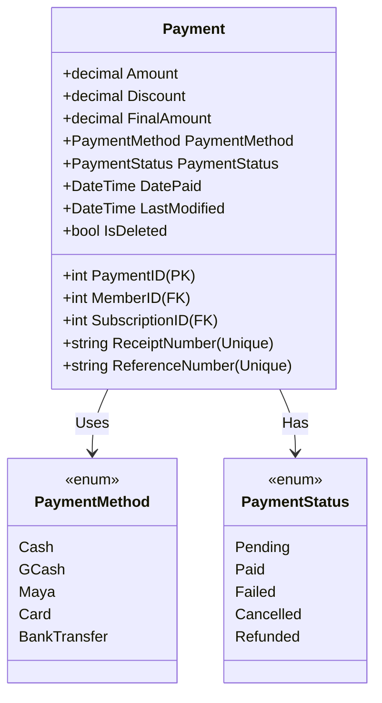

# Payments Architecture

This document describes the design, business rules, and integration workflows for the GymTrackPro Payments module.

---

## 1. Business Rules

*   **BR-01 (Activation Dependency)**: A member's subscription status cannot transition to `Active` unless a successful payment with status `Paid` has been recorded.
*   **BR-02 (Receipt Number Uniqueness)**: Every payment transaction generates a unique receipt number matching the format `REC-YYMMDDHHMMSS-RAND` (e.g. `REC-260702091530-4821`). Receipt numbers are validated for uniqueness before saving.
*   **BR-03 (Reference Number Uniqueness)**: Online payment methods (GCash, Maya, Card, BankTransfer) require a non-empty, globally unique `ReferenceNumber` to prevent double-processing.
*   **BR-04 (Soft Refunds)**: Refunding a completed transaction updates the payment status to `Refunded` and updates the associated subscription to `Cancelled`. No records are deleted.
*   **BR-05 (Positive Financial Fields)**: Base payment amounts and discounts must be greater than or equal to zero. Discounts cannot exceed the base transaction amount.
*   **BR-06 (Auditing)**: Every payment transaction logs a security audit log (e.g. `Payment Completed`, `Payment Refunded`, `Subscription Activated`).
*   **BR-07 (Immutability)**: Once a payment status becomes `Paid` or `Refunded`, it is immutable. Edits to values or deletion of records are blocked at the application level.

---

## 2. API Contract

### 2.1 Endpoints List
*   `GET /api/v1/Payments/{id}` (Authorized) - Retrieve payment details by ID.
*   `GET /api/v1/Payments/member/{memberId}` (Authorized) - Retrieve transaction history for a specific member.
*   `POST /api/v1/Payments` (Authorized) - Create and process a new payment transaction.
*   `POST /api/v1/Payments/{id}/refund` (Restricted: Admin Only) - Mark a payment transaction as `Refunded`.
*   `GET /api/v1/Payments/search` (Authorized) - Search/filter transactions by date, status, method, member, or receipt number.

### 2.2 Request/Response Data Shapes

#### Process Payment Request (`CreatePaymentDto`)
```json
{
  "memberID": 1,
  "subscriptionID": 5,
  "amount": 1200.00,
  "discount": 100.00,
  "paymentMethod": "GCash",
  "paymentStatus": "Paid",
  "referenceNumber": "REF-983742918"
}
```

#### Success Response (`ApiResponse<PaymentResponseDto>`)
```json
{
  "success": true,
  "message": "Payment processed successfully.",
  "data": {
    "paymentID": 1,
    "memberID": 1,
    "memberName": "Alice Smith",
    "subscriptionID": 5,
    "planName": "Standard Monthly Pro",
    "amount": 1200.00,
    "discount": 100.00,
    "finalAmount": 1100.00,
    "paymentMethod": "GCash",
    "paymentStatus": "Paid",
    "receiptNumber": "REC-260702091530-4821",
    "referenceNumber": "REF-983742918",
    "datePaid": "2026-07-02T01:18:00Z",
    "lastModified": "2026-07-02T01:18:00Z"
  },
  "errors": []
}
```

---

## 3. Data Model

### 3.1 Payment Schema & Relationships



---

## 4. Security

*   **Role-Based Access Control (RBAC)**:
    *   **Create Payment / Read**: Allowed for both `Administrator` and `Receptionist` roles.
    *   **Refund Payment**: Restrained exclusively to `Administrator` role. Attempts by `Receptionist` fail with `403 Forbidden`.

---

## 5. Integration Points

*   **Subscription Module**: Listens to payments to transition subscription statuses from `PendingPayment` to `Active` or `Cancelled` (on refund).
*   **Audit Service**: Logs security and financial history.

---

## 6. Testing Coverage

The payment integration suite verifies:
1.  **Cash Payment processing** (completes successfully and activates subscription).
2.  **Online Payment Validation**: Fails if `ReferenceNumber` is missing for `GCash`/`Maya`/etc.
3.  **Unique Reference constraints**: Blocks duplicate reference numbers.
4.  **Immutability and Negative Amount bounds**.
5.  **Refund Processing**: Mark completed payments as `Refunded` and updates subscription status to `Cancelled`.
6.  **Search Queries**: Filters transactions by statuses, payment modes, receipt codes, etc.

---

## 7. Known Limitations

*   **Split Payments**: The system currently assumes a single payment method per transaction. Split payments (e.g. paying part cash and part GCash) are not supported.

---

## 8. Architecture Decisions

*   **Why Immutability of Completed Payments?**
    *   *Decision*: For auditing and financial transparency, a completed transaction must never be altered or hard deleted. Corrections are exclusively handled through refunds.
*   **Why Separate Payments from Subscriptions?**
    *   *Decision*: Keeps the financial ledger decoupled from the subscription state machine. Changing billing or payment integration details does not impact membership duration logic.
