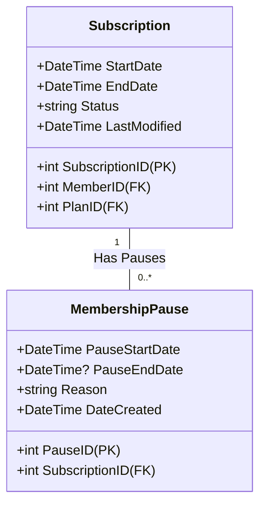

# Membership Lifecycle Architecture

This document describes the design, business rules, state transitions, and integration workflows for the GymTrackPro Membership Lifecycle (Subscription) module.

---

## 1. Business Rules

*   **Initial Pending State**: All new subscriptions are created with the status `PendingPayment`. They do not allow gym access (failing BR-01 active subscription check in the attendance check-in engine) until successfully paid.
*   **Activation on Payment**: A subscription transitions to `Active` when a related payment with status `Paid` is processed.
*   **Pause State Restrictions**:
    *   Only active memberships (`Status == "Active"`) can be paused.
    *   Pausing changes the status to `Paused`, logs a pause record with `PauseStartDate = UtcNow`, and blocks gym access.
*   **Resume and extension**:
    *   Only paused memberships (`Status == "Paused"`) can be resumed.
    *   Resuming logs `PauseEndDate = UtcNow`.
    *   **Extension Math**: The membership `EndDate` is extended by the number of days the membership was paused: `pausedDays = Max(1, Ceiling(PauseEndDate - PauseStartDate))`. This ensures the member does not lose any days they paid for.
*   **Date calculation**: Subscription expiration is calculated automatically as `StartDate + Plan.DurationDays` upon creation.

---

## 2. API Contract

### 2.1 Endpoints List
*   `GET /api/v1/Subscriptions/{id}` (Authorized) - Get subscription details by ID.
*   `GET /api/v1/Subscriptions/member/{memberId}` (Authorized) - Retrieve subscription history for a member.
*   `POST /api/v1/Subscriptions` (Authorized) - Register a new subscription (defaults to `PendingPayment`).
*   `POST /api/v1/Subscriptions/{id}/pause` (Authorized) - Pause an active subscription.
*   `POST /api/v1/Subscriptions/{id}/resume` (Authorized) - Resume a paused subscription.

### 2.2 Request/Response Data Shapes

#### Create Subscription Request (`CreateSubscriptionDto`)
```json
{
  "memberID": 1,
  "planID": 3,
  "startDate": "2026-07-02T00:00:00Z"
}
```

#### Pause Subscription Request (`PauseSubscriptionDto`)
```json
{
  "reason": "Medical leave due to injury"
}
```

#### Success Response (`ApiResponse<SubscriptionResponseDto>`)
```json
{
  "success": true,
  "message": "Subscription created successfully.",
  "data": {
    "subscriptionID": 5,
    "memberID": 1,
    "memberName": "Alice Smith",
    "planID": 3,
    "planName": "Gold Annual",
    "startDate": "2026-07-02T00:00:00",
    "endDate": "2027-07-02T00:00:00",
    "status": "PendingPayment",
    "lastModified": "2026-07-02T01:18:00Z"
  },
  "errors": []
}
```

---

## 3. Data Model

### 3.1 Subscription Schema & Relationships



---

## 4. Security

*   **Role-Based Access Control (RBAC)**:
    *   Both `Administrator` and `Receptionist` roles are allowed to subscribe members, lookup details, pause memberships, and resume memberships.

---

## 5. Integration Points

*   **Member Management Module**: Verifies member exists and retrieves names.
*   **Membership Plans Module**: Looks up pricing and duration constraints.
*   **Payments Module**: Triggers subscription status transitions to `Active` or `Cancelled` depending on processed transactions.
*   **Attendance Module**: Inspects subscription date limits and status to permit gym check-ins.
*   **Audit Service**: Records membership status transitions.

---

## 6. Testing Coverage

The subscription lifecycle integration tests verify:
1.  **Initial Registration**: Checks that subscriptions start as `PendingPayment`.
2.  **Pause Validation**: Asserts that only active subscriptions can be paused, and verifies status updates.
3.  **Resume & Extension**: Checks that resuming extends the membership expiration date by the number of paused days.
4.  **Security & RBAC restrictions**.

---

## 7. Known Limitations

*   **Plan Upgrades**: There is currently no automated upgrade/downgrade logic (pro-rating payments). Staff must cancel the current subscription and register a new one.

---

## 8. Architecture Decisions

*   **Why Pause Records in a Separate Table?**
    *   *Decision*: Modeling pauses in a separate table (`MembershipPauses`) preserves a detailed audit history of pauses for each subscription, enabling future reports on member freeze history and preventing data loss.
*   **Why Automate End-Date Extensions?**
    *   *Decision*: Calculating and extending the end date during resumption automatically protects members' prepaid days, eliminating human calculation error by staff.
