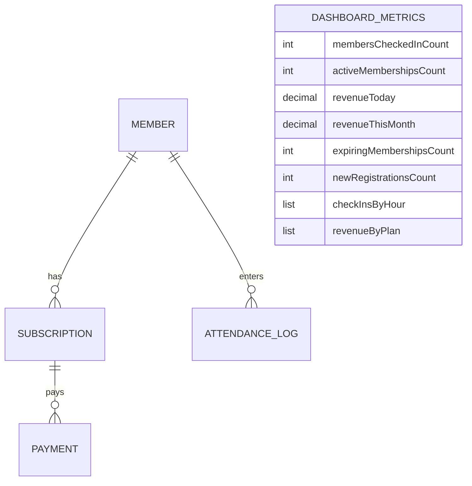

# Dashboard Architecture

This document describes the design, business rules, metrics, and integration details for the GymTrackPro Dashboard module.

---

## 1. Business Rules

*   **Real-time Metrics**: All metrics are computed dynamically on-demand directly from the live database. No caching is introduced to prevent display stale data.
*   **Operational Definition**:
    *   *Checked In Count*: Calculated where `CheckOutTime` is null.
    *   *Active Memberships*: Total subscriptions with status `Active`.
    *   *Daily/Monthly Revenue*: Net total amount of successfully cleared payments (`PaymentStatus == Paid`) within the designated time ranges.
    *   *Expiring Count*: Subscriptions ending within the upcoming 7 days.
*   **Hourly Activity**: Groups attendance logs of the current day by the hour (0-23) to highlight foot-traffic peaks.
*   **Plan Popularity**: Summarizes and displays total net revenue grouped by subscription plan.

---

## 2. API Contract

### 2.1 Endpoints List
*   `GET /api/v1/Dashboard/metrics` (Authorized) - Retrieve all active dashboard metrics.

### 2.2 Request/Response Data Shapes

#### Success Response (`ApiResponse<DashboardMetricsDto>`)
```json
{
  "success": true,
  "message": "Dashboard metrics retrieved successfully.",
  "data": {
    "membersCheckedInCount": 12,
    "activeMembershipsCount": 154,
    "revenueToday": 4500.00,
    "revenueThisMonth": 124500.00,
    "expiringMembershipsCount": 8,
    "newRegistrationsCount": 15,
    "checkInsByHour": [
      { "hour": 8, "count": 5 },
      { "hour": 9, "count": 12 }
    ],
    "revenueByPlan": [
      { "planName": "Platinum VIP", "revenue": 85000.00 },
      { "planName": "Standard Monthly", "revenue": 39500.00 }
    ]
  },
  "errors": []
}
```

---

## 3. Data Model

The Dashboard utilizes data mapped from multiple entities:



---

## 4. Security

*   **Role-Based Access Control (RBAC)**:
    *   Both `Administrator` and `Receptionist` roles are authorized to access the dashboard metrics to monitor member activity.

---

## 5. Integration Points

*   **Attendance Logs**: Feeds check-in foot traffic metrics.
*   **Subscriptions**: Identifies active, expiring, and plan-specific distribution counts.
*   **Payments**: Aggregates daily/monthly revenue.
*   **Members**: Feeds registration counts.

---

## 6. Testing Coverage

The dashboard E2E integration tests verify:
1.  **Metric verification**: Validates that active, checked-in, and registration counts are computed accurately.
2.  **Date constraints**: Confirms that revenue amounts only include today's cleared records.
3.  **Group-by distributions**: Asserts check-in hourly distributions and plan revenue groups.

---

## 7. Known Limitations

*   **Scale Limits**: In large-scale gyms with millions of transactions, calculating sum/count aggregates on the fly may cause latency. Caching or database materialized views may be needed if latency increases.

---

## 8. Architecture Decisions

*   **Why Calculate on-the-Fly?**
    *   *Decision*: For a gym manager/receptionist, seeing real-time attendance and payment registrations is critical. Caching would delay updating the checked-in headcount, causing staff discrepancies.
