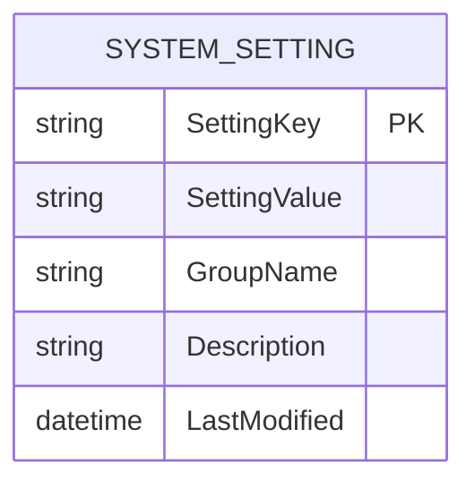

# System Settings Architecture

This document describes the design, database schema, configuration rules, and integration details for the GymTrackPro System Settings module.

---

## 1. Business Rules

*   **Dynamic Configurations**: All system configuration parameters are stored as database key-value strings. This allows administrators to adjust operational limits without recompiling or redeploying code.
*   **Groups**: Settings are organized into structural groups:
    *   *General*: Gym Name, Timezone, Currency, Contact Number.
    *   *Membership*: QR code prefix, expiration alert intervals.
    *   *Payments*: Receipt invoice prefixes.
    *   *Security*: Photo size upload limit, allowed image extension types, password complexity regex.
*   **Self-Healing Seed**: During startup, if the `SystemSettings` table is detected as empty, the platform automatically populates all 10 default settings.

---

## 2. API Contract

### 2.1 Endpoints List
*   `GET /api/v1/Settings` (Authorized) - Retrieve all active system settings (accessible to Admins & Receptionists).
*   `PUT /api/v1/Settings/{key}` (Authorized) - Modify a system setting value (restricted to `Administrator` role).

### 2.2 Request/Response Data Shapes

#### Update Setting Payload (`UpdateSettingDto`)
```json
{
  "settingValue": "GTP-NEW-"
}
```

#### Update Setting Response (`ApiResponse<string>`)
```json
{
  "success": true,
  "message": "System setting 'QRPrefix' updated successfully.",
  "data": "QRPrefix",
  "errors": []
}
```

---

## 3. Data Model

The settings module uses a single database table:



---

## 4. Security

*   **Role-Based Access Control (RBAC)**:
    *   `GET` requests are open to both `Administrator` and `Receptionist` roles.
    *   `PUT` modifier endpoints are strictly limited to `Administrator` accounts.
*   **Audit Logging**: Every settings modification triggers a security audit log detailing the key modified, the original value, the new value, and the executing administrator's user ID and client IP address.

---

## 5. Integration Points

*   **Member QR Generation**: Automatically reads the `QRPrefix` settings parameter when minting a new member QR code check-in key.
*   **Member Image Uploads**: Reads `MaxUploadSize` setting to validate base64 image data sizes during registration and profile updates.
*   **Payment Receipts**: Reads the `ReceiptPrefix` parameter during checkout to generate unique invoices.

---

## 6. Testing Coverage

The settings E2E integration tests verify:
1.  **Retrieve all**: Asserts that all 10 settings are returned on GET.
2.  **Role permissions**: Confirms Receptionists are blocked from editing settings, while Administrators are authorized.
3.  **Audit trail**: Validates that setting edits are written to audit logs.
4.  **Behavioral integration**: Asserts that changing `QRPrefix` dynamically changes the prefix of newly created members.

---

## 7. Known Limitations

*   **Serialized Values**: For structured objects (like dictionary tables or list arrays), values must be serialized to JSON strings prior to storage in the `SettingValue` column.

---

## 8. Architecture Decisions

*   **Why a Key-Value Database Store?**
    *   *Decision*: Hardcoding values in config files (like `appsettings.json`) requires developer access to change. Moving them to the database allows non-technical administrators to adjust gym parameters dynamically from a management console.
