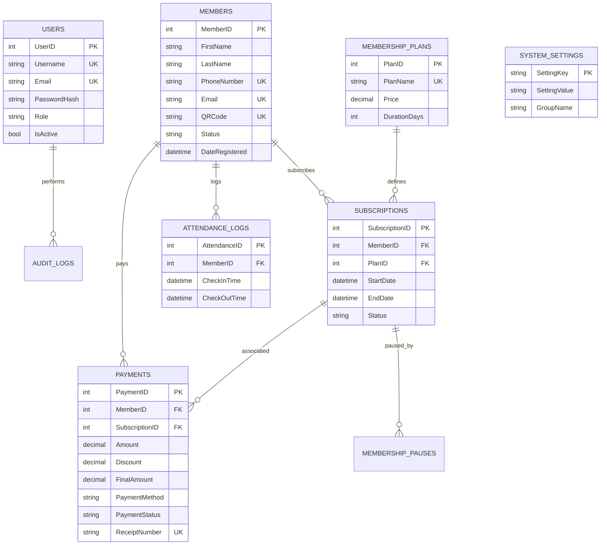
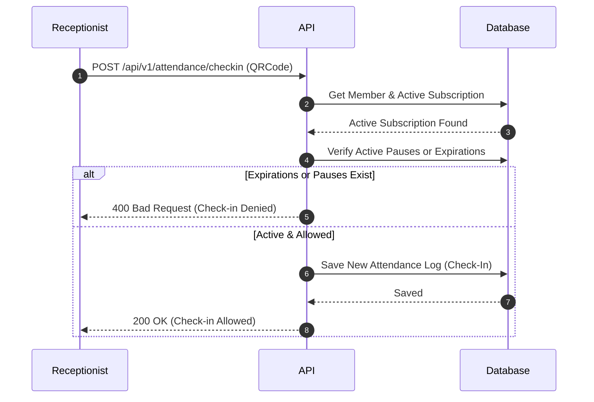
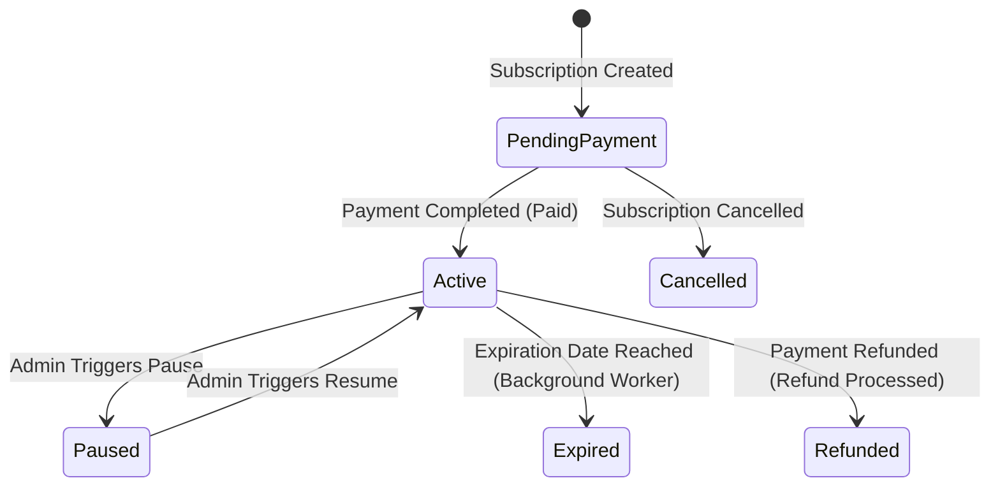

# System Architecture Guide

This document serves as the master architectural reference for the GymTrackPro platform. It details the layers, database diagrams, dependency graphs, business life cycles, and design patterns utilized throughout the system.

---

## 1. Overall Architecture

GymTrackPro is designed as a modular, layered system separating presentation, business logic, data persistence, and cross-cutting security layers. 

```mermaid
graph TD
    subgraph Mobile Client (MAUI App)
        V[Views / UI] --> VM[ViewModels]
        VM --> AS[API Services]
        AS --> SQLite[(Local SQLite DB)]
    end

    subgraph Backend Web API (ASP.NET Core)
        C[Controllers] --> S[Business Services]
        S --> R[Repositories]
        R --> DB[(SQL Server DB)]
        S --> Firebase[Firebase Integration]
    end

    AS -- "HTTPS JSON API" --> C
```

---

## 2. Clean Architecture Layers

*   **GymTrackPro.Shared**: Holds core domain definitions, database entity mappings, DTO structures, interfaces, and enums. It has zero external dependencies, acting as the pure domain core.
*   **GymTrackPro.API**: Implements the REST API presentation layer (Controllers), business rules (Services), database access (Repositories), and ASP.NET infrastructure (Middlewares, background jobs).
*   **GymTrackPro.Mobile**: Cross-platform MAUI client application utilizing ViewModels, local SQLite cache databases, and remote API synchronization workers.

---

## 3. Directory Structure

```text
IT123P.GymTracker.APP/
├── docs/                      # Architectural specifications and ADRs
├── scratch/                   # End-to-End integration test suites
└── src/
    ├── GymTrackPro.Shared/    # Core domain entities, DTOs, interfaces, and enums
    │   ├── DTOs/
    │   ├── Entities/
    │   ├── Enums/
    │   └── Interfaces/
    ├── GymTrackPro.API/       # REST controllers, services, repositories, migrations
    │   ├── Controllers/
    │   ├── Data/
    │   ├── Middleware/
    │   ├── Repositories/
    │   └── Services/
    └── GymTrackPro.Mobile/     # MAUI cross-platform UI views and ViewModels
```

---

## 4. Database Schema (ERD)

The relational schema maps out user roles, member demographics, subscription lifecycles, and check-in attendance logs:



---

## 5. Key Workflows and Sequence Flows

### 5.1 QR Check-In Flow
Validates membership status dynamically before allowing entrance:



### 5.2 Subscription & Payment Life Cycle
Secures transactions and transitions subscription state machines:



---

## 6. Design Patterns Used

*   **Repository Pattern**: Decouples business logic from EF Core DbContext query details.
*   **Dependency Injection (DI)**: Constructor-based injection is used across ViewModels, Controllers, and Services.
*   **State Machine Pattern**: Manages transitions of subscription states (Active, PendingPayment, Paused, Expired).
*   **Self-Healing Startup Seed**: Automatic seed verification for initial system settings.

---

## 7. Security Architecture

*   **Token Authorization**: JWT authentication using secure signing keys.
*   **Role-Based Access Control (RBAC)**: Roles defined (`Administrator`, `Receptionist`) mapping distinct access bounds.
*   **Input Validation & Parameterization**: Strict EF Core LINQ query expressions to completely eliminate SQL Injection threats.
